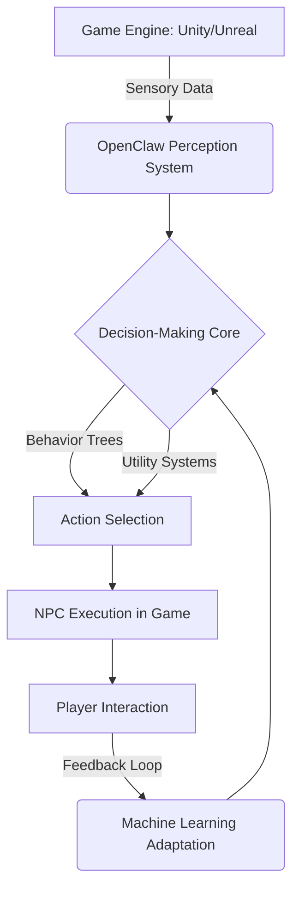

# OpenClaw 游戏开发自主NPC智能体

## Title
OpenClaw在游戏开发中的自主NPC应用

## Sources
- https://www.techedubyte.com/openclaw-game-development-ai-agent-framework/

## 1. 应用场景 (Application Scenario)
在现代游戏开发（特别是开放世界、策略游戏和RPG）中，传统的硬编码脚本方法往往导致NPC（非玩家角色）行为具有高度的可预测性和重复性。该用例使用OpenClaw作为一个自主的AI代理框架，直接植入游戏引擎，旨在为游戏创建能根据玩家行动和环境变化动态适应、甚至能够产生“情感”反应和战术演进的智能实体。

## 2. 技术方案 (Technical Architecture/Solution)
在系统架构中，OpenClaw扮演**Actor**（行为执行实体）的核心决策层。具体工作流与技术整合如下：
- **引擎集成**：OpenClaw作为AI插件直接集成到Unity、Unreal Engine或Godot等主流游戏引擎中。
- **决策机制 (Decision-Making)**：摒弃纯静态脚本，基于行为树（Behavior Trees）和效用系统（Utility Systems）进行实时情境评估。
- **感知与学习引擎**：
  - **Perception Systems (感知系统)**：处理来自游戏引擎的视觉/听觉/空间输入。
  - **Emotional Modeling (情感建模)**：允许NPC展现逼真的反应，并随时间推进与玩家建立动态的关系网络。
  - **机器学习适应**：AI代理不断收集玩家的交互模式，通过局部微调调整策略参数，实现经验积累。
- **Heartbeat & 异步处理**：利用环境的心跳机制（Heartbeat）周期性地触发长期的战略评估和大规模NPC群体（宏观）的状态更新。
- **工具链支持**：使用OpenClaw提供的可视化行为编辑器无代码配置转移条件和学习参数。

## 3. 实现效果 (Results/Outcomes)
- **优势 (Pros)**：极大地提升了NPC和整体游戏世界的生动性；开放世界中形成了能自主运转的NPC生态群落；可视化编辑器大幅降低了开发门槛和周期。
- **劣势与挑战 (Cons)**：多代理（Multi-agent）并发决策对游戏主线程的性能消耗较大。
- **优化空间 (Improvements)**：当前通过异步处理和AI LOD（细节级别计算，远距离NPC简化计算）来缓解性能问题，未来可考虑将复杂的集群AI训练卸载至云端服务进行处理。

## 4. 其他相关信息 (Other Info)
这是OpenClaw在娱乐与虚拟仿真领域的一次跨界尝试。该框架的跨平台灵活性及其强大的模块化架构，表明它不仅可以作为桌面助手，也能在高度动态的3D环境中充当独立的“虚拟数字人”中枢。未来社区计划引入更加完善的多智能体协调机制和增强的神经网络节点。