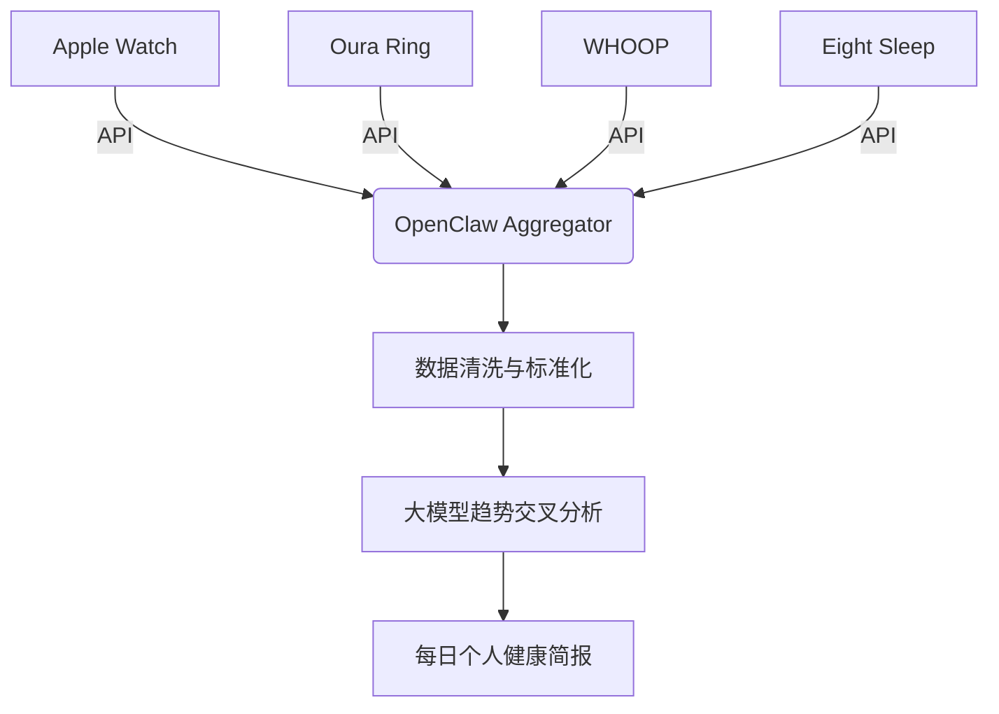

# 跨设备健康数据聚合与分析 (Health Data Aggregator)

## Sources
- https://www.gradually.ai/en/openclaw-use-cases/

## 1. 应用场景 (Application Scenario)
**背景与目的**：
用户通常佩戴多种健康监测设备（如 Apple Watch、Oura Ring、WHOOP 和 Eight Sleep），这些设备各自拥有独立的应用和数据孤岛。为了获得全面的健康视图，需要一种机制将分散的心率变异性(HRV)、睡眠质量、恢复得分等指标进行统一收集和关联分析。

**痛点与挑战**：
- 跨平台数据壁垒，缺乏原生集成的接口。
- 数据量庞大且维度多样，难以手动整理关联。
- 需要在保护隐私的前提下完成本地化的个人数据聚合计算。

## 2. 技术方案 (Technical Architecture/Solution)
此方案中，OpenClaw 扮演 **Aggregator (聚合器)** 的角色，作为中心化的数据抓取和清洗中枢。

- **Skills / Plugins**: 
  - `health-sync-api`: 用于通过 API 接口统一调取各类可穿戴设备数据。
  - `data-aggregator-skill`: 将异构 JSON 数据结构映射至标准化的内部模型。
- **Heartbeat Configuration**: 
  - 结合 Cron Job 配置为每天早晨 (如 07:00) 唤醒会话。
  - `HEARTBEAT.md` 包含指令：“拉取昨夜睡眠数据及今日恢复指标，交叉验证后生成简报”。
- **工作流 (Workflow)**:
  1. 定时任务触发，唤醒 OpenClaw 进行处理。
  2. 并行调用各个设备的开放 API 抓取原始时序数据。
  3. 本地化清洗数据并交给大模型进行交叉对比（例如：将床垫的深度睡眠数据与指环的心率趋势对齐）。
  4. 提炼个性化建议（例如调整下午的咖啡因摄入量）并推送到用户的默认通知渠道。

## 3. 实现效果 (Results/Outcomes)
**优点**：
- 实现了真正的量化自我 (Quantified Self) 统一仪表盘，打破厂商数据孤岛。
- 全自动每日生成，为用户提供比任何单一平台都更丰富且多维的关联洞察。
**不足与改进空间**：
- 强依赖各设备厂商 API 的稳定性和开放程度。
- 健康数据属高度敏感隐私，要求 OpenClaw 节点必须具备极高的本地运行安全防御，避免数据向外泄漏。

## 4. 其他相关信息 (Other Info)
该用例首次展示了 OpenClaw 在异构 IoT 体系中充当统一“数据层与逻辑层”的潜力，并可进一步与饮食管理和日程安排进行联动（例如根据恢复得分自动调整当日日历上的高强度会议日程）。