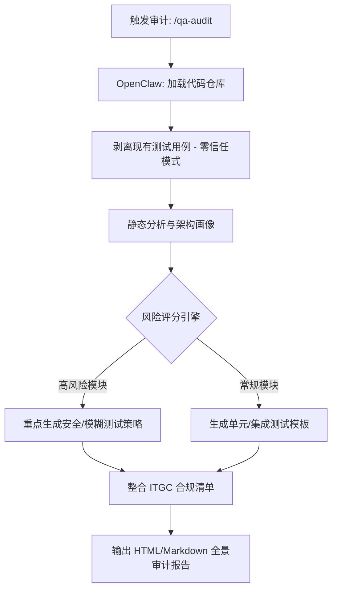

# QA Architecture Auditor (质量保证架构审计员)

## Sources
- [DEV Community: Why I stopped writing manual test cases: This OpenClaw skill does it for me](https://dev.to/shifu_legend/why-i-stopped-writing-manual-test-cases-this-openclaw-skill-does-it-for-me-3ni2)

## 1. 应用场景 (Application Scenario)
- **背景**: 传统的软件测试用例编写过程极其耗时、枯燥且容易出错。随着代码库和微服务的增长，手动编写涵盖所有边界情况和异常处理的测试已成为产品发布的瓶颈。不同开发者的测试覆盖标准不统一，并且容易忽略安全性、负载以及突变测试等关键领域。此外，IT 审计和合规往往要求详细的结构化测试计划与控制文档。
- **目的**: 引入 OpenClaw 作为“零信任质量架构审计员”，让其独立读取整个代码库，自动化生成涵盖超过 20 种测试方法的综合性 QA 策略、风险热力图以及具体的测试代码片段。
- **痛点解决**: 消除了手动编写测试模板的繁杂劳动，避免了人类测试者由于习惯造成的“盲区”，并为后续合规审计提供了机器生成的、客观全面的基线参考。

## 2. 技术方案 (Technical Architecture/Solution)
整个流程围绕 OpenClaw 与其 `qa-architecture-auditor` 技能展开，其核心系统角色（System Role）为 **Auditor（审计者）**。

### 工作流详情：
1. **触发审计 (Trigger)**: 开发或 QA 工程师通过 OpenClaw 对话界面使用 `/qa-audit --repo <path> --format html` 指令（或 CLI）激活该技能。OpenClaw 可配合 **Heartbeat (心跳机制)** 实现持续集成的定期扫描（如每晚自动审计新代码）。
2. **零信任代码分析 (Zero-Trust Analysis)**: OpenClaw 刻意忽略项目中已存在的测试文件，完全从第一性原理出发，对代码语言、框架、架构模式（如单体/微服务）、依赖关系和数据流向进行“取证级”静态分析。
3. **风险评估与画像 (Risk Scoring)**: 基于代码圈复杂度、外部 API 调用、加密处理、文件 I/O 等维度，为每个模块打分（0-100分）。例如处理身份验证的模块被标记为“高危”，重点纳入安全测试目标。
4. **策略生成与测试组装 (Strategy Generation)**: 根据技术栈动态生成针对性的测试用例模板。涵盖黑/白盒、单元、端到端、模糊测试、突变测试等，甚至自动产出压测脚本（例如生成针对接口的 `locust` 代码）。
5. **合规项映射 (ITGC Compliance)**: 输出针对项目架构定制的 IT 通用控制（ITGC）合规检查清单。

### 核心架构图示

## 3. 实现效果 (Results/Outcomes)
- **优点**: 
  - **指数级提效**: 将撰写系统级测试计划的时间从数周压缩至几分钟，大幅减轻了 QA 团队的重复劳动。
  - **消除测试盲点**: 引入了模糊测试、突变测试等高级实践，并根据风险分数智能分配注意力，防止测试覆盖面的“偏科”。
  - **角色升级**: QA 工程师无需再充当“测试用例打字员”，而是转变为“QA 架构师”，专注于业务逻辑精调、复杂断言设计以及推进自动化测试流水线的集成。
- **缺点/改进空间**: 
  - **闭环缺失**: 目前该系统主要是生成测试策略报告与测试用例骨架，暂未完全内置将这些用例回写进代码库并利用 CI 自动执行闭环验证的能力。
  - **大模型上下文限制**: 对于极端庞大且缺少结构化文档的遗留系统，纯静态扫描与大模型上下文的结合可能会出现理解不够深入的问题。

## 4. 其他相关信息 (Other Info)
- **安装途径**: 该技能已上线 ClawHub，可以通过 `clawhub install qa-architecture-auditor` 一键安装。
- **社区反响**: 开发者反馈，通过将这类脏活累活交由 Agent 处理，团队可以更轻松地通过严苛的安全审查和 ITGC 审计。
