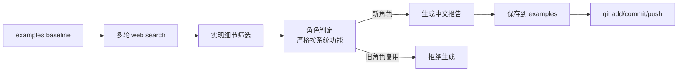

# OpenClaw Use-Case Reporter

## Sources
- https://docs.openclaw.ai/automation/tasks
- https://www.freecodecamp.org/news/how-to-build-and-secure-a-personal-ai-agent-with-openclaw/
- https://composio.dev/toolkits/heartbeat/framework/openclaw
- https://www.lennysnewsletter.com/p/openclaw-the-complete-guide-to-building

## 1. 应用场景
OpenClaw 的使用案例正在快速扩展，但大量公开内容仍停留在“能做什么”的宣传层，缺少可复用、可落地、带架构细节的真实样板。这个用例的目标不是执行单一自动化，而是**持续搜索、筛选、判定并沉淀新 use case**，用于维护 OpenClaw 生态知识库。

难点有三个：
1. 公开信息噪声很大，很多文章只是概念介绍。
2. 分类必须严格按 OpenClaw 的**技术/架构角色**，不能按行业或职业贴标签。
3. 需要把“是否真的新”与“只是换了个业务场景”的案例区分开。

因此，这个用例本质上是一个**Auditor_**：它审计外部材料、验证技术细节、做新颖性判定，并输出可归档报告。

## 2. 技术方案
### 架构角色判定
- **角色前缀**：`Auditor_`
- **理由**：OpenClaw 在这里不是业务执行器，而是“证据审查 + 规则判定 + 文档归档”系统。
- **拒绝项**：`Finance_`、`HR_`、`Trader_` 之类都不成立，因为它们描述的是行业或岗位，不是系统功能。

### 工作流
1. 读取当前 examples 目录，建立 baseline。
2. 用多组不同查询做 web search，避免重复搜到同类结果。
3. 过滤掉纯概念文、营销文、无实现细节的内容。
4. 用严格规则判断是否属于新 architectural role：
   - 新角色则归类为新前缀。
   - 若只是旧角色的新场景，拒绝。
5. 选择最具实现细节的来源，抽取内容理解其真实架构。
6. 产出中文技术报告并保存到 examples 仓库。
7. 必要时进行 git 提交和推送。

### 关键能力映射
| 能力 | 作用 |
|---|---|
| `web_search` | 发现近期公开 use case |
| `web_fetch` | 读取原文，确认实现细节 |
| `read` / `exec` | 检查 baseline 与目录状态 |
| `update_plan` | 管理多步审计流程 |
| `memory_search` | 回看近期约束与已知结论 |

### 参考架构图

### Heartbeat / Cron
- 这类工作适合 **cron**，不是 heartbeat。
- 原因：它是一次性的审计与归档任务，不是持续状态检查。
- 若需要周期性更新，可改为定时 cron 任务去重复执行该审计流程。

## 3. 实现效果
### 优点
- 规则明确，能避免把行业当成角色。
- 结果可复核，来源可追溯。
- 适合维护 OpenClaw examples 仓库的质量边界。

### 缺点
- 依赖公开材料质量，容易被宣传内容稀释。
- 新角色判定主观性仍然存在，需要更严格的基线维护。

### 改进方向
- 为 `Auditor_` 增加更细子类，比如 `SourceAuditor_`、`ArchitectureAuditor_`。
- 建立“已收录角色白名单 + 拒绝模板”，降低重复判断成本。

## 4. 其他相关信息
已确认的相关实现细节包括：
- OpenClaw 的任务系统区分 `cron`、`subagent`、`acp`、`cli` 等背景执行来源。
- 任务是“记录”，不是调度器，调度逻辑仍由 cron / heartbeat 负责。
- 社区文章中明确提到：OpenClaw 通过技能、API、CLI、cron、heartbeat 组成可运行的代理体系。

本次结论：**可生成报告，分类为 `Auditor_`。**
