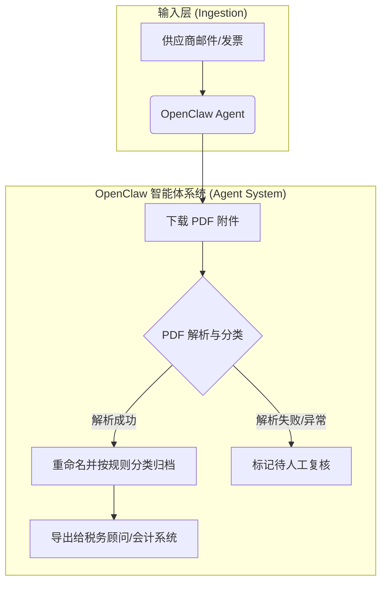

# Accounting Intake from Email & PDFs

## 1. 业务场景与价值 (Business Context & Value)
企业后台的财务处理通常存在巨大的运营摩擦。在此实例中，OpenClaw 接管了一个专门的财务邮箱，自动识别并提取收到的发票与财务文档附件，对其进行解析和预处理，从而替代了此前需要手动下载、重命名以及分类整理归档的繁琐流程。

**核心商业价值**：
- **消除重复协同成本**：将原本依赖于人工定期操作的月度记账周期前置工作自动化。
- **平滑嵌入现有流程**：不需要企业替换现有的 ERP 软件，而是通过自动化“进件流”提升整个流转效率。

## 2. 系统架构与工作流 (System Architecture & Workflow)

## 3. 技术组件拆解 (Technical Components Breakdown)

| 组件类型 | 详细说明 |
| :--- | :--- |
| **Skills / Tools** | `email_reader` (读取收件箱邮件与附件), `pdf_parser` / `ocr_tool` (提取财务文本及结构化数据), `fs_manager` (本地文件系统隔离沙盒与重命名分类)。 |
| **Heartbeats / Cron** | 依赖 `Cron` 每日定时触发（或 `Heartbeats` 定期轮询），拉取并批量处理邮箱中新增的待入账邮件。此方式大幅降低了人工打断频率，使得记账过程可以完全异步且无感地完成。 |
| **Guardrails** | 文件系统级隔离以防范隐私数据泄露，针对解析置信度设置阈值，一旦低于阈值则“静默失败”并移交人工审批池。 |

## 4. 商业评估与量化 (Business Evaluation & Quantization)
发票处理的准确率对系统可用性至关重要。假设系统处理准确率为 $P_{acc}$，人工复核单份错误数据的成本惩罚为 $C_{penalty}$，则每份发票处理的期望收益 $E(R)$ 为：

$$ E(R) = P_{acc} \cdot V_{auto} - (1 - P_{acc}) \cdot C_{penalty} $$

因此，系统的核心在于不断提升文档解析引擎的置信度边界，并对边界外数据实施坚固的隔离审核。

## 5. 参考来源 (References)
- [Codebridge: OpenClaw Business Use Cases](https://www.codebridge.tech/articles/openclaw-case-studies-for-business-workflows-that-show-where-autonomous-ai-creates-value-and-where-enterprises-need-guardrails)
