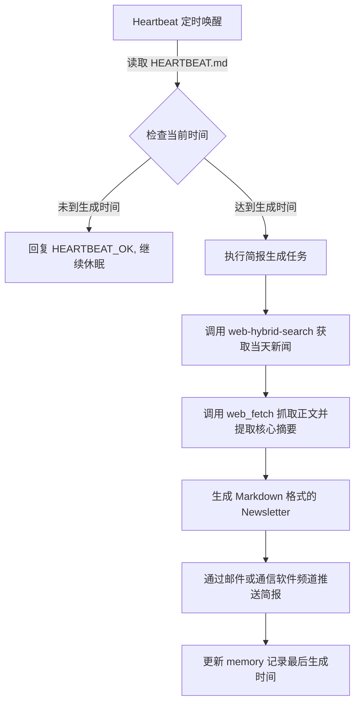

# 自动化行业新闻简报生成器 (Auto-Newsletter Generator)

**来源**: [Skywork AI - The Ultimate Guide to OpenClaw Heartbeat.md Example](https://skywork.ai/skypage/en/ultimate-guide-openclaw-ai-agent/2038533037563396096)

## 1. 应用场景 (Application Scenario)

**背景与目的**:
对于需要跟踪前沿技术发展或市场动态的专业人士和团队来说，每天花费大量时间筛选信息不仅耗时且容易遗漏重点。本方案利用 OpenClaw 打造一个全自动的新闻简报（Newsletter）生成引擎，通过定时唤醒执行信息搜集、内容总结和排版，并在指定时间推送给用户或团队。

**面临的挑战**:
* **信息过载**: 每天产生的新闻量巨大，提取高质量信息存在难度。
* **定时触发机制**: 需要一个稳健的周期性触发机制来替代人工干预。
* **上下文隔离**: 防止每次新闻生成污染长期的对话上下文。

## 2. 技术方案 (Technical Architecture/Solution)

**工作流概览**:
该用例主要依靠 OpenClaw 的 **Heartbeat (心跳机制)** 与 `cron` 工具的组合，并结合多个自带技能。



**核心组件与配置**:

1. **Heartbeat 配置 (HEARTBEAT.md)**:
   在工作区根目录下配置 `HEARTBEAT.md`，指示 Agent 在每次被周期性唤醒时检查简报生成状态：
   ```markdown
   # Daily Automation Checklist
   - Check if current time is around 17:00.
   - If daily newsletter/doc is not generated today, start creation.
   - Use web-hybrid-search to find the top 5 AI industry news today.
   - If done, log the completion timestamp to memory/heartbeat-state.json.
   ```

2. **涉及的 Skills/Tools**:
   * `cron`: 确保系统维持稳定的心跳，例如设置每小时发送一次唤醒事件。
   * `web-hybrid-search`: 混合检索当天的高质量行业链接。
   * `web_fetch`: 读取目标网页内容（自动转化为 Markdown 格式供大模型阅读）。
   * `default_api:write`: 将最终的简报输出到指定文件或平台。

## 3. 实现效果 (Results/Outcomes)

**优势 (Pros)**:
* **真正的“自治”**: 将被动的聊天机器人变成了主动服务的工作室，不再需要用户手动输入 Prompt 触发。
* **极高的定制化**: 用户可以通过修改 `HEARTBEAT.md` 随时调整简报的侧重点（如重点关注“开源模型”或“芯片行业”）。
* **资源节约**: 心跳机制中的 `HEARTBEAT_OK` 设计有效减少了在空闲时段消耗的 Token。

**不足与优化空间 (Cons/Improvements)**:
* **信息茧房**: 搜索引擎的返回可能受限于固定的关键词，建议定期通过 cron 注入随机的探索主题。
* **页面反爬限制**: 部分高质量新闻网站可能屏蔽 `web_fetch` 的基础爬虫抓取，必要时需要接入专业的新闻 API（如 NewsAPI）。

## 4. 其他相关信息 (Other Info)

* **实施成本**: 非常低。利用默认的混合搜索和内置的文件操作能力，几乎不需要额外开发代码。
* **扩展场景**: 此架构可直接扩展为“每日竞品动态监测”、“股市收盘自动复盘”等高频信息处理任务。