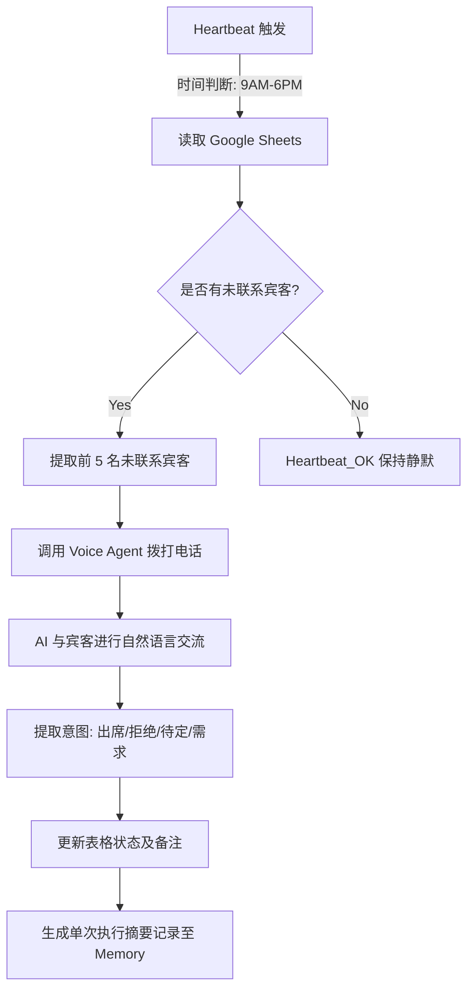

# 自动化活动宾客电话确认与跟进 (Automated Event Guest Voice Confirmation)

**Sources**: [awesome-openclaw-usecases](https://github.com/hesamsheikh/awesome-openclaw-usecases)

## 1. 应用场景 (Application Scenario)
- **背景与目的**: 在筹备中大型活动（如婚礼、商业发布会、行业峰会）时，主办方通常需要逐个致电受邀宾客确认其是否出席、收集特殊饮食需求或记录留言。这项工作耗时耗力。本用例旨在利用 OpenClaw 结合 AI 语音拨打能力，自动批量拨打电话，与宾客进行自然对话，并汇总最终的确认名单与备注。
- **难点与挑战**: 
  - AI 需要能够应对通话过程中的突发状况或模糊回答（如“我可能晚点到”、“还不确定”）。
  - 需要在合适的通话时间（如工作日白天）进行拨打，避免打扰宾客休息。
  - 需要将非结构化的语音对话转化为结构化的数据（如出席状态、特殊需求）并更新至数据库或表格。

## 2. 技术方案 (Technical Architecture/Solution)
本方案主要利用 OpenClaw 的定时心跳（Heartbeat）机制结合外部通信与表格处理技能来实现自动化。

### 核心组件
- **Skills**: 
  - `bland-ai-caller` / `twilio-voice-agent`: 用于发起双向 AI 语音通话。
  - `google-sheets` / `airtable-manager`: 用于读取未拨打的宾客名单，并回写出席状态及对话摘要。
- **Heartbeat (心跳配置)**: 
  使用 `HEARTBEAT.md` 结合 Cron 机制实现任务的平滑调度，避免一次性并发拨打数百个电话触发平台风控。

### 工作流配置 (Workflow)



### Heartbeat 配置示例
在工作区的 `HEARTBEAT.md` 中定义如下逻辑：
```markdown
# 宾客确认任务巡检
- **时间窗限制**: 如果当前时间不在 09:00 - 18:00 之间，或者今天是周末，请直接回复 HEARTBEAT_OK。
- **任务逻辑**: 
  1. 使用表格技能读取 "Event_Guests" 表格，筛选 `Status = 'Uncontacted'` 的前 5 条记录。
  2. 如果为空，直接回复 HEARTBEAT_OK。
  3. 如果有数据，逐一调用语音拨号技能致电，Prompt 设定为：“您好，我是活动的 AI 助手，请问您下周五是否能出席我们的峰会？”。
  4. 将收集到的结果（Attendance, Dietary_Notes）写回表格。
```
配合 Gateway 的定时器配置，每小时触发一次心跳，从而将大量的拨打任务分散到一整天内完成。

## 3. 实现效果 (Results/Outcomes)
- **优势 (Pros)**: 
  - 极大地节省了人力成本，使得团队可以将精力集中在活动策划本身。
  - 数据自动化回写避免了人工录入可能造成的疏漏。
  - Heartbeat 分批拨打机制有效提升了成功率，并模拟了真实的人工工作节奏。
- **劣势 (Cons)**: 
  - 部分年长宾客可能对 AI 语音的反馈不够适应，或者会直接挂断电话。
  - 遇到极其复杂的询问（如询问活动具体议程细节），AI 可能由于预设信息不足而产生幻觉或反复绕圈子。
- **改进空间 (Areas for improvement)**: 
  可以配置 fallback 机制，即当 AI 无法理解宾客意图或宾客表现出不耐烦时，自动通过短信发送确认链接，或者标记为“需人工介入 (Requires Human Intervention)”。

## 4. 其他相关信息 (Other Info)
- **费用预估**: 使用主流的 AI 电话 API，每次长达一分钟的确认通话成本约在 $0.10 - $0.15 之间，相较于外包客服团队仍具显著成本优势。
- **安全与隐私**: 需要确保处理宾客电话号码时符合当地的隐私法规（如 GDPR 或 CCPA），并在录音/通话前做好 AI 身份声明。