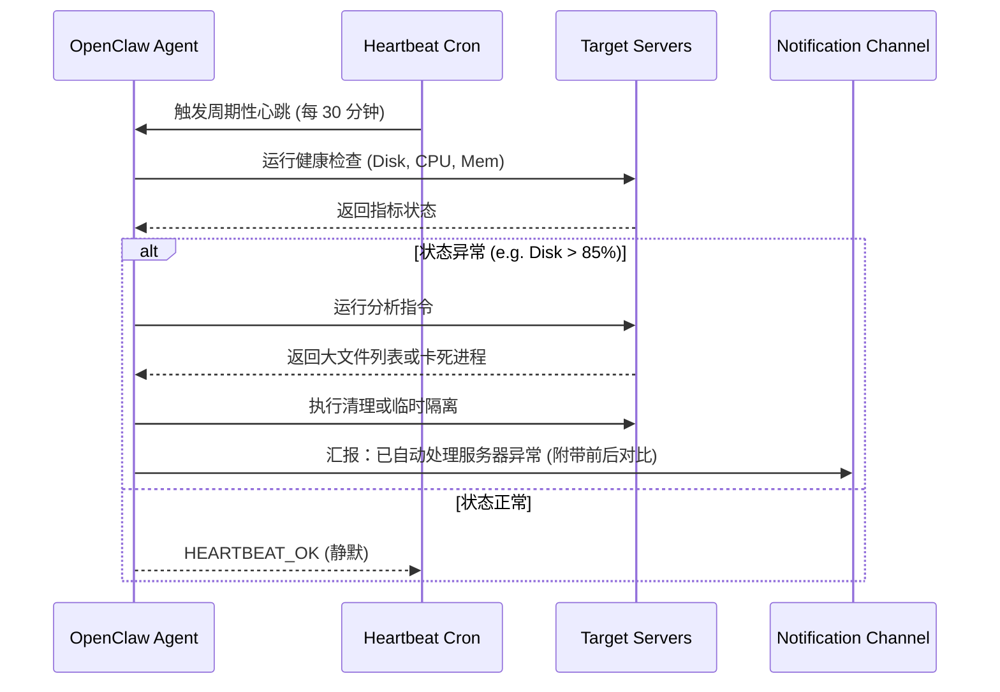

# 自动化服务器监控与智能故障响应代理

**Sources**: https://quantumbyte.ai/articles/openclaw-use-cases, https://www.hostinger.com/tutorials/openclaw-use-cases

## 1. 应用场景 (Application Scenario)
**背景与目的**：
在现代分布式云原生架构中，服务器节点众多，微服务依赖复杂。当某一台服务器出现磁盘告警、CPU异常飙升或 SSH 连接被拒绝时，传统的监控方案通常只能发送静态告警，需要运维工程师手动登录服务器排查问题。这在夜间尤其影响运维团队的休息，且响应时间不可控。
本项目通过部署一个专属的 OpenClaw 运维代理（DevOps Agent），实现了对指定服务器集群的 24/7 智能化监控、自动排查以及轻量级故障自动修复。

**痛点与挑战**：
- 传统告警缺乏上下文：告警邮件只有“CPU > 90%”，没有进程堆栈和分析。
- 修复重复劳动多：诸如“磁盘满了去清理旧日志”、“Docker容器卡死重启”等操作极其机械。
- 安全性要求高：自动执行运维命令需要严格的安全边界和权限管理，防止误操作。

## 2. 技术方案 (Technical Architecture/Solution)
此方案充分利用了 OpenClaw 的长期在线特性、周期性调度以及安全的受限执行环境。

**使用的核心组件**：
- **Skills (技能)**: `healthcheck` (安全审计和版本状态检查), `ssh` (远程服务器执行命令)。
- **Plugins (插件)**: 消息通道插件（如 Slack、Discord 或 Telegram），用于告警通知与人工审批通道。
- **Heartbeat (心跳)**: 设定每 30 分钟一次的心跳触发周期，代理会在心跳唤醒时主动拉取各服务器的关键指标。

**Heartbeat 配置详解**：
为了不产生过高的 API 消耗，运维代理在 `memory/heartbeat-state.json` 中跟踪上一次检查时间。每次 Heartbeat 触发时：
1. 读取本地 `server-list.json` 中配置的主机清单。
2. 并发执行轻量级探测脚本（如 CPU load, Disk usage）。
3. 当检测到异常（如 /var/log 占用过高），调用大模型分析并根据预置白名单生成清理命令。
4. 如果一切正常，直接静默恢复 `HEARTBEAT_OK`，不打扰人类。

**架构设计 (Mermaid 序列图)**：

## 3. 实现效果 (Results/Outcomes)
**优点 (Pros)**：
- **降低 MTTR**：从人工响应的平均 45 分钟下降到 2 分钟内。
- **免打扰**：大量日常低级告警被自动消化并汇总为“每日早报”，不再实时轰炸团队。
- **动态排查**：能够基于现场报错信息，动态搜索文档并给出修复建议，而不是死板的固定脚本。

**缺点与不足 (Cons)**：
- **权限风险**：虽然限制在特定目录，但自动执行仍有一定的“越权清理”风险。
- **网络盲区**：如果服务器本身网络隔离或宕机，Agent 仅能发出告警，无法自愈。

**改进方向 (Areas for Improvement)**：
- 引入**人类审批环 (Human-in-the-loop, /approve)** 机制：对于高危操作，必须推送到消息频道并等待团队成员点击授权后，OpenClaw 再执行后续流程。

## 4. 其他相关信息 (Other Info)
- **依赖库**: 建议配合 ansible 或 terraform 插件，实现基础设施级别的动态配置。
- **推荐部署模型**: 对于复杂的日志分析，建议在执行期间临时拉起 `subagents` 独立进行，防主进程上下文过长或污染 `MEMORY.md`。