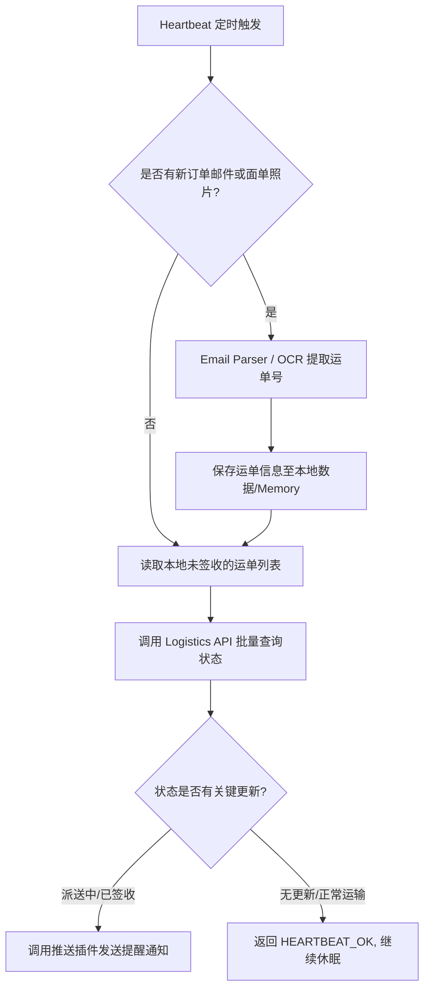

# 自动快递追踪助手 (Automatic Package Tracking)

**Sources**: https://www.hostinger.com/tutorials/openclaw-use-cases

## 1. 应用场景 (Application Scenario)
- **背景**: 现代生活网购频繁，包裹物流信息往往分散在不同平台的订单确认邮件、短信或包含快递面单的照片中。
- **目的**: 自动整合并追踪所有即将到达的快递最新状态，建立统一的物流看板。
- **痛点/挑战**: 人工从大量邮件中提取运单号并逐个打开各家物流网站进行查询非常耗时，且容易遗漏重要包裹。同时，跨不同承运商追踪进一步增加了数据管理的复杂度。

## 2. 技术方案 (Technical Architecture/Solution)
通过组合 OpenClaw 的多项能力，打造完全自动化的后台追踪流。

- **核心使用组件**:
  - **Skills (技能)**:
    - `email-parser`: 用于自动扫描并解析订单确认邮件中的物流承运商与运单号。
    - `vision-ocr`: 调用视觉模型读取用户发送的快递标签照片，提取单号。
    - `logistics-api`: 调用第三方聚合物流查询接口（如快递100 API 等）获取实时物流轨迹。
  - **Heartbeat (心跳机制)**: 
    - 配置为每隔几小时触发一次。Heartbeat 启动后，OpenClaw 会静默扫描邮箱或信息流，同时查询所有“未签收”状态运单的最新进度。如果发现状态变更（如“派送中”、“已签收”），则触发后续动作；若无更新，则静默返回 `HEARTBEAT_OK`，不打扰用户。
  - **Plugins (插件)**:
    - 消息推送插件（如 QQ/Telegram/Discord bot 插件），用于在关键物流节点向用户发送实时提醒。

## 3. 实现效果 (Results/Outcomes)
- **优点**: 全自动化统一管理所有包裹动态，大幅降低了人工查询和记忆包裹到达时间的心理负担。通过 Heartbeat 实现无感查询，仅在必要时通知。
- **缺点**: 强依赖邮箱授权及外部物流 API 的覆盖率与准确度。部分小型承运商可能不支持自动查询。
- **改进方向**: 可进一步结合日历（Calendar）技能，在获取到“预计到达时间”后，自动在用户的日程表中添加“收快递”提醒事件。

## 4. 其他相关信息 (Other Info)
推荐将此类通知统一归集至专门的 IM 频道（例如 QQ 频道的特定子频道 或 Telegram 的静音通知频道），以免频繁的物流节点更新对日常工作造成干扰。