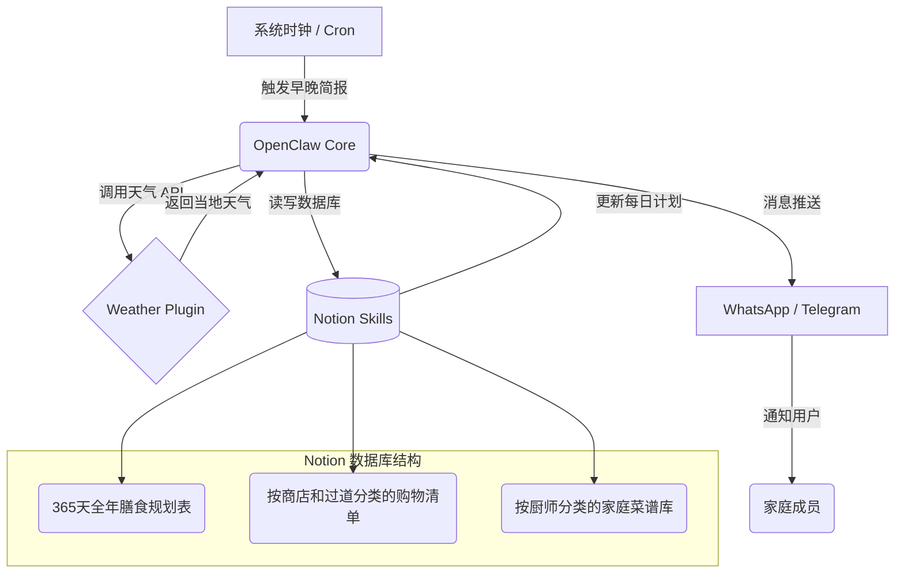

# OpenClaw 应用实例报告：Crawdad 自动化家庭膳食与杂货助理

## 1. 概述与应用场景

### 1.1 背景与目标
在现代家庭的高节奏生活中，夫妻双方常常轮流承担烹饪任务。规划全年的膳食、追踪家中食材库存，以及根据不同商店和货架整理购物清单，是一项高度重复且耗时的家务。
本项目名为 **Crawdad**，旨在通过 OpenClaw 构建一个完全自动化的智能助理系统，彻底接管家庭膳食后勤规划。

### 1.2 核心痛点
- 碎片化的清单：购物清单分散在多处，且未按照实体店（如 Kroger、Costco）的地理过道排序。
- 缺乏动态调整：传统的静态食谱无法根据当日天气变化（如：冷天适合炖汤，晴朗适合烧烤）自动调整。
- 遗忘率高：在繁忙的工作日，常常忘记提前解冻食材或规划晚餐。

## 2. 技术架构与解决方案实现

为达成上述目标，Crawdad 将 OpenClaw 作为控制中枢，联动了 Notion 数据库、第三方天气 API 与即时通讯工具。

### 2.1 整体架构图 (工作流)

### 2.2 核心组件解析

为实现此系统，读者需要在 OpenClaw 中配置以下核心组件：

| 组件类型 | 具体应用 / 工具 | 功能描述 |
| :--- | :--- | :--- |
| **Skills (技能)** | `notion-api-skill` | 用于读取和更新 Notion 中的主膳食计划模板、购物清单和菜谱。代理 Notion 的 CRUD 操作。 |
| **Plugins (插件)** | `weather-plugin` | 获取当地实时与未来天气预报。利用 Open-Meteo 等免费接口实现。 |
| **Cron (定时任务)** | 每日早晚触发器 | 在 `crontab` 中配置早间与晚间任务。早间推送当晚餐食提醒（如需解冻肉类）；晚间推送次日购物清单。 |
| **Hooks (钩子)** | `pre_meal_plan_hook` | 在向 Notion 写入新膳食计划前，自动对比天气数据（若下雨则替换户外烧烤菜谱）。 |
| **Surface (通道)** | Telegram / WhatsApp | 绑定通讯软件机器人，允许用户在群组中与 Crawdad 自然对话、临时添加购物项。 |

### 2.3 关键逻辑：智能清单排序
通过解析菜谱中所需的食材，自动将其映射至特定商超。假设 $L$ 为购物清单集合，$I_n$ 为具体食材，系统通过映射函数 $f(I_n) \rightarrow (Store, Aisle)$ 实现精准分类，极大降低了用户在超市的游走时间。

## 3. 实现效果评估

- **效率提升**：预计每周为家庭节省 1-2 小时的纯规划与超市购物时间。
- **用户体验**：无缝融入了用户现有的消息软件，交互成本极低。
- **可改进空间**：当前高度依赖外部 API 的稳定性。若 Notion 平台接口延迟较高，可能导致早间简报生成超时。未来可引入本地化的 SQLite 数据库作为缓存层。

## 4. 参考信息与来源

- **来源 URL**：[OpenClaw Showcase - What People Are Building](https://openclaw.ai/showcase)
- **环境要求**：支持 OpenClaw 基础环境（Node.js/Python），以及对应的第三方平台 API Keys。