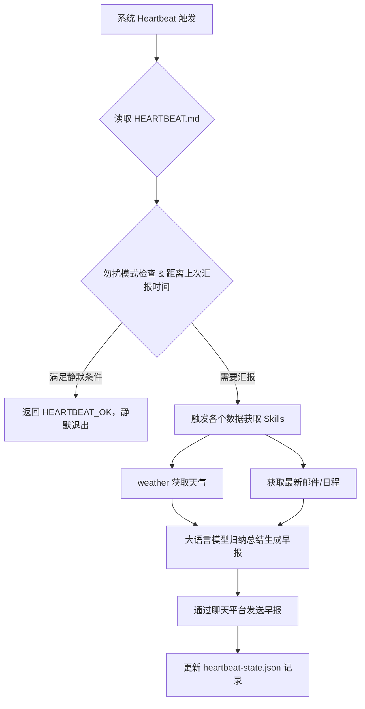

# 个人生活助理：基于 Heartbeat 的智能早报与日程管理

**Sources:**
- https://github.com/hesamsheikh/awesome-openclaw-usecases
- https://docs.openclaw.ai/concepts/architecture

## 1. 应用场景 (Application Scenario)
现代都市人群面临信息过载的问题，每天需要处理邮件、查看日历、关注天气以及各大社交平台的通知。传统方式需要用户主动打开多个App，费时费力且容易遗漏重要日程。本案例旨在利用 OpenClaw 构建一个个人生活助理，在每日特定时间或用户触发时，自动整合所需信息并生成每日简报（Daily Briefing），同时能对即将到来的日程进行主动提醒。

困难与挑战：
- 多个数据源的整合（邮件、日历、天气等）
- 避免过度打扰（只在关键时间节点或存在高优事项时推送）
- 保持系统的低功耗以及连贯的上下文认知

## 2. 技术方案 (Technical Architecture/Solution)
通过 OpenClaw Gateway 架构，核心流程依赖于各种 Skills 工具集以及 OpenClaw 的 **Heartbeat** 唤醒机制。

*   **Heartbeat 配置与工作原理**: 
    配置 OpenClaw 定期（如每 30 分钟）接收系统级 Heartbeat 唤醒。在工作空间的 `HEARTBEAT.md` 中设定了详细的巡检判定逻辑：
    1. 通过 `memory/heartbeat-state.json` 检查上次汇报天气和邮件的时间。
    2. 判断当前时间是否在“勿扰模式”（23:00-08:00）。如果在此期间且无紧急情况，则仅向主循环返回 `HEARTBEAT_OK`，保持静默。
    3. 如果到了早报时间（如 08:00），则主动使用相关技能检索数据，组装成人类易读的早报并发送。

*   **使用的组件与 Skills**:
    - `weather` 技能: 检索用户所在地的当前天气与预报。
    - 日程与邮件获取技能: 整合本地或云端的日程表与未读邮件。

*   **工作流程架构图 (Workflow)**:

## 3. 实现效果 (Results/Outcomes)
**优点**：
- 实现了真正的智能主动服务（Proactive Assistant），助理能在最合适的时间发送早报。
- 借由 `HEARTBEAT.md` 的约束，避免了传统定时任务在周末或休假期间依然生硬打扰的现象。助理能够理解上下文并作出“现在不宜打扰”的判断。

**不足及改进空间**：
- Heartbeat 定期唤醒会消耗一定的 LLM Token 预算。虽然返回 `HEARTBEAT_OK` 能最小化回复输出，但上下文读取仍产生消耗。
- 建议针对常规心跳检查设置专用的低功耗子模型。

## 4. 其他相关信息 (Other Info)
结合 OpenClaw 的 `cron` 组件，如果发现日程中有距离现在不足2小时的紧急会议，还可以动态注册一次性的 cron 任务进行精准的会前倒计时提醒，从而将定期的 Heartbeat 检查与精准的 Cron 提醒完美结合。