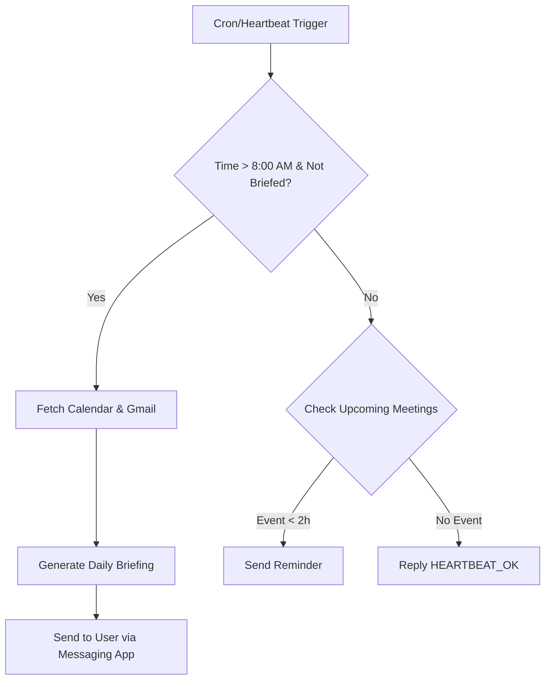

# Title: Daily Executive Briefing & Calendar Management

**Sources**: https://creatoreconomy.so/p/master-openclaw-in-30-minutes-full-tutorial

## 1. 应用场景 (Application Scenario)

**Background & Purpose**: 
Entrepreneurs, executives, and freelancers often struggle to keep track of their daily meetings, urgent emails, and task lists. Traditional calendar apps require manual checking, and email clients are often cluttered. The purpose of this use case is to use OpenClaw as a proactive virtual assistant that reviews the user's Google Workspace (Calendar & Gmail) each morning and provides a concise, personalized daily briefing directly via a messaging channel (e.g., Telegram or Discord), as well as ongoing updates throughout the day.

**Difficulties & Challenges**:
- **Information Overload**: Filtering out promotional emails and non-essential meetings from the critical ones.
- **Timing**: Delivering the briefing exactly when the user starts their day, and updating dynamically if schedules change.
- **Integration**: Securely connecting to Google Workspace without exposing full data, and maintaining conversational context over messaging platforms.

## 2. 技术方案 (Technical Architecture/Solution)

To implement this proactive briefing system, OpenClaw relies on a combination of Google integrations and the core Heartbeat scheduling mechanism.

**Skills & Plugins Used**:
- `google-workspace` Skill: For reading Google Calendar events and Gmail inbox.
- `telegram` (or `discord`) Plugin: To deliver the briefing to the user's preferred messaging app.

**Hooks**:
- `on_message` hook is used to parse quick user commands like "reschedule my 2 PM meeting."

**Heartbeat Configurations**:
The core engine driving this use case is the OpenClaw Heartbeat system. A custom `HEARTBEAT.md` is configured in the workspace to prompt OpenClaw to check for upcoming events and unread urgent emails automatically.

```markdown
# HEARTBEAT.md

Check the following at each heartbeat:
1. Are there any meetings in the next 2 hours on my Google Calendar?
2. Are there any unread emails marked as "Important" or from key domains (e.g., @company.com)?
3. If it's the first heartbeat after 8:00 AM, generate the "Daily Executive Briefing" summarizing the day.
If there are updates, send a message to the user. If nothing needs attention, reply `HEARTBEAT_OK`.
```

*State Tracking*: OpenClaw tracks its checks in `memory/heartbeat-state.json` to avoid repeating the same morning briefing.
```json
{
  "lastChecks": {
    "dailyBriefing": 1712620800,
    "calendar": 1712642400
  }
}
```

**Workflow Diagram**:


## 3. 实现效果 (Results/Outcomes)

**Pros (Advantages)**:
- **Proactive Management**: The user no longer needs to actively pull information; the assistant pushes relevant data when needed.
- **Time Saving**: Aggregating emails and calendar events into one quick read saves roughly 30 minutes every morning.
- **Highly Customizable**: The `HEARTBEAT.md` logic can easily be tweaked to include weather (`weather` skill) or news headlines.

**Cons & Limitations**:
- **Context Window Limits**: If the user receives hundreds of emails overnight, the assistant might hit token limits when summarizing them.
- **False Positives**: Sometimes AI marks an email as "urgent" when it is just aggressively worded marketing.

**Areas for Improvement**:
- Integrating an auto-draft feature where OpenClaw not only summarizes the email but proposes a draft response via Gmail API.
- Adding a specific Cron job just for the morning briefing, rather than relying purely on the interval-based Heartbeat, to ensure it triggers at an exact time (e.g., 08:00 sharp).

## 4. 其他相关信息 (Other Info)

- **Security Note**: This setup requires granting OpenClaw OAuth access to the user's Google account. It is recommended to use an isolated OpenClaw instance and strict firewall rules.
- **Cost**: Depending on the model used (e.g., GPT-4o or Claude 3.5 Sonnet), checking emails frequently via Heartbeat can accumulate API costs. Adjusting the heartbeat interval to 30 or 60 minutes mitigates this.