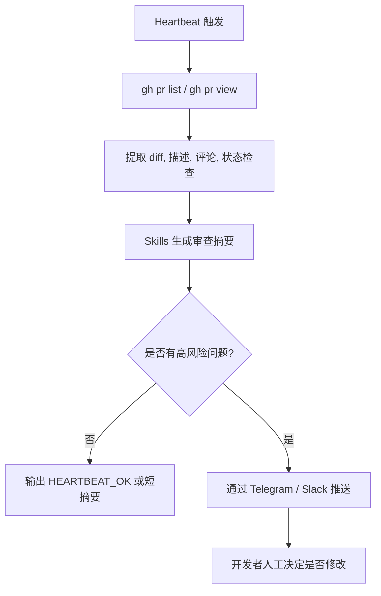

# OpenClaw 应用实例报告：GitHub PR 审查与 Telegram 通知流

## Sources
- https://zenvanriel.com/ai-engineer-blog/openclaw-github-pr-review-automation-guide/
- https://docs.openclaw.ai/gateway/heartbeat
- https://docs.openclaw.ai/channels/slack
- https://docs.github.com/en/repositories/configuring-branches-and-merges-in-your-repository/managing-protected-branches/about-protected-branches

## 1. 应用场景 (Application Scenario)

### 背景与目的
很多团队会遇到同一个问题，PR 打开了，但真正有价值的第一轮审查没人及时看到。开发者要么在 GitHub 里刷页面，要么等群里有人提醒。这个用例把 OpenClaw 放在“看得见变化、但不直接改仓库”的位置上，专门负责：
- 发现新 PR
- 拉取差异与上下文
- 做第一轮自动审查
- 把结果推送到 Telegram 等高可见通道

目的不是替代人工 review，而是让人工更快看到关键问题。

### 难点与挑战
- **不想给机器人写权限**，但又希望它能读懂仓库变化。
- **PR 信息碎片化**，只看标题不够，得结合 diff、评论、CI 状态。
- **通知要落到人常看的地方**，GitHub 评论不一定是最佳入口。
- **要可控、可审计**，因此适合 read-only + 人工确认的模式。

## 2. 技术方案 (Technical Architecture/Solution)

### 2.1 总体思路
该方案采用 **Heartbeat + CLI 读取 + 通知插件 + GitHub Branch Protection** 的组合：
- **Heartbeat** 负责周期性扫描新 PR、失败 CI 和待处理事件。
- **Skills** 负责解析 PR、生成审查摘要、提炼风险点。
- **Plugins / Channels** 负责把结果发到 Telegram 或其他消息通道。
- **Hooks** 负责在工具调用前后记录审查痕迹，保证可追踪性。
- **GitHub 分支保护** 作为最后一道安全网，确保 AI 只能分析，不能绕过合并规则。

### 2.2 组件清单
| 组件 | 作用 | 关键配置 |
|---|---|---|
| Heartbeat | 定期检查 PR / CI | `every: 30m`, `lightContext: true` |
| GitHub CLI | 拉取 PR / issue / run 信息 | `gh pr view`, `gh issue view`, `gh run view` |
| Telegram / Slack 通道 | 推送审查摘要 | 将结果发到开发者常看的位置 |
| Hooks | 审计、状态记录 | `after_tool_call`, `on_reset` |
| Branch Protection | 约束合并路径 | 必须 review、必须 CI |

### 2.3 Heartbeat 解析
Heartbeat 适合这个场景，因为 PR 审查是**持续发生、但不要求秒级精确**的工作。

推荐配置：
```json5
{
  agents: {
    defaults: {
      heartbeat: {
        every: "30m",
        target: "last",
        directPolicy: "allow",
        lightContext: true,
        isolatedSession: true,
        includeReasoning: false,
        prompt: "Read HEARTBEAT.md if it exists (workspace context). Follow it strictly. Do not infer or repeat old tasks from prior chats. If nothing needs attention, reply HEARTBEAT_OK.",
        ackMaxChars: 300
      }
    }
  }
}
```

**解析**：
- `every: "30m"`：足够及时，且不会让检查过于频繁。
- `target: "last"`：把通知发给最近一次外部会话或联系人，适合人类跟进。
- `lightContext: true`：Heartbeat 只带必要上下文，降低 token 消耗。
- `isolatedSession: true`：每次检查独立运行，减少上下文污染，适合读多写少的审查任务。
- `HEARTBEAT_OK`：如果没有新 PR 或可疑 CI，直接安静退出。

### 2.4 PR 审查流水线


### 2.5 Skills、Hooks、Plugins 的分工
- **Skills**：
  - PR diff 归纳
  - 风险模式识别
  - CI 失败摘要
  - 建议测试点生成
- **Hooks**：
  - 记录每次 `gh` 调用结果
  - 发生异常时附加上下文
  - 避免无意义重复提醒
- **Plugins / Channels**：
  - Telegram：适合高优先级提醒
  - Slack：适合团队协作流
  - 也可扩展到 Discord / QQ 频道

### 2.6 GitHub 安全边界
建议把机器人权限控制在只读：
- `gh pr view` 读 PR 内容
- `gh run view` 读 CI 日志
- `gh issue view` 读 issue 描述
- 不自动 merge、不自动 close、不自动 assign

分支保护继续负责：
- 必须 PR review
- 必须 CI 通过
- 禁止 force push
- 必要时要求签名提交

### 2.7 典型配置表
| 项目 | 推荐值 | 原因 |
|---|---|---|
| Heartbeat 间隔 | 30m | 平衡及时性与成本 |
| 会话模式 | isolatedSession: true | 降低上下文污染 |
| 上下文大小 | lightContext: true | 只保留必要文件 |
| 输出策略 | 先通知，再人工决策 | 保持控制权 |
| 危险动作 | 禁止自动写入 | 降低误操作风险 |

## 3. 实现效果 (Results/Outcomes)

### 优点
- PR 第一轮筛选更快，开发者不用自己反复刷 GitHub。
- 机器人只读不写，安全边界清晰。
- Telegram / Slack 通知比 GitHub 评论更容易被看见。
- CI 失败也能一起收敛到同一条提醒链路里。

### 缺点
- 仍然依赖 GitHub CLI 和通知通道的稳定性。
- 复杂 diff 可能需要更长上下文，成本会上升。
- 如果规则写得太宽，容易产生噪音通知。

### 改进方向
- 为不同仓库建立不同的审查模板。
- 把高风险文件路径单独加权，比如认证、支付、部署脚本。
- 增加“只在工作时间推送”的 Heartbeat 限制。

## 4. 其他相关信息 (Other Info)

- 这个模式本质上是“读多写少”的 AI 协作方式。
- 如果团队更偏消息协作，Slack 也可替代 Telegram。
- 若需要精确时刻执行，例如某个 release 后立刻审查，Cron 更合适。
- 适合与 branch protection、CODEOWNERS、CI gating 一起使用。
