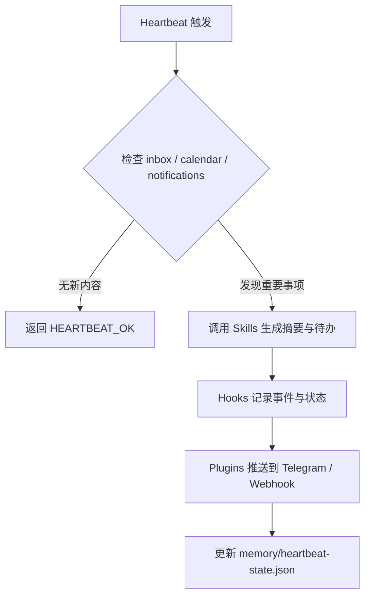

# OpenClaw 应用实例报告：Heartbeat 驱动的收件箱与日程运维助理

## Sources
- https://docs.openclaw.ai/automation/cron-vs-heartbeat
- https://docs.openclaw.ai/gateway/heartbeat
- https://docs.openclaw.ai/automation/hooks
- https://docs.openclaw.ai/plugins/architecture

## 1. 应用场景 (Application Scenario)

### 背景与目的
很多 OpenClaw 用户的日常管理负担，并不在“写一段回复”，而在“持续盯住那些不能错过的小变化”，例如：
- 新邮件里是否出现了紧急事项
- 日程是否临时变更
- 通知流里是否有需要立即处理的消息
- 是否到了该跟进某个未完成任务的时间点

这个用例的目标，是把 OpenClaw 变成一个**低打扰、持续在线、带上下文感知的后台助理**。它不追求每次都主动发消息，而是优先静默检查，只在发现真正需要人介入的事项时才通知。

### 难点与挑战
- **频繁轮询的成本**：如果把所有检查都放进 Cron，会增加任务记录和调度复杂度。
- **上下文保留**：很多判断需要结合最近的对话、待办、记忆和用户偏好。
- **静默与打扰的平衡**：没事时要安静，有事时要足够明确。
- **事件分流**：邮件、日程、Webhook、手动消息，各自触发路径不同，需要统一编排。

## 2. 技术方案 (Technical Architecture/Solution)

### 2.1 总体思路
本方案采用 **Heartbeat + Hooks + Plugins + 轻量技能** 的组合：
- **Heartbeat** 负责周期性主会话检查，默认每 30 分钟一次，用于批量处理 inbox、calendar、notifications。
- **Hooks** 负责事件驱动的深度处理，例如工具调用前后审计、会话重置时清理状态。
- **Plugins** 负责对接外部输入和输出通道，例如 Gmail、Calendar、Telegram、Webhook。
- **Skills** 负责具体动作，例如读邮箱、读日历、生成摘要、写结构化记录。

### 2.2 组件清单
| 组件 | 作用 | 配置重点 |
|---|---|---|
| Heartbeat | 周期性检查 | `every: 30m`, `target: last`, `lightContext: true` |
| Hooks | 生命周期拦截 | `before_agent_start`, `after_tool_call`, `on_reset` |
| Plugins | 外部系统接入 | Gmail、Calendar、Telegram、Webhook |
| Skills | 具体任务执行 | 邮件筛选、日程总结、摘要生成、记录归档 |

### 2.3 Heartbeat 配置解析
Heartbeat 是这个方案的核心，因为它更适合“持续关注但不强制精确时间点”的工作。

推荐配置：
```json5
{
  agents: {
    defaults: {
      heartbeat: {
        every: "30m",
        target: "last",
        directPolicy: "allow",
        lightContext: true,
        isolatedSession: false,
        prompt: "Read HEARTBEAT.md if it exists (workspace context). Follow it strictly. Do not infer or repeat old tasks from prior chats. If nothing needs attention, reply HEARTBEAT_OK.",
        ackMaxChars: 300
      }
    }
  }
}
```

**解析**：
- `every: "30m"`：适合收件箱/日程这种半小时级别延迟可接受的任务。
- `target: "last"`：把结果送回最近一次外部会话，便于用户连续接收摘要。
- `lightContext: true`：只保留必要的 `HEARTBEAT.md` 上下文，降低成本。
- `isolatedSession: false`：保留主会话上下文，方便判断“这个邮件是否和上次那封有关”。
- `HEARTBEAT_OK`：无事则静默返回，避免刷屏。

### 2.4 Hooks 解析
Hooks 更适合处理“事件一来就做”的动作，不替代 Heartbeat，而是补足它。

可用方式：
- `before_agent_start`：在主流程开始前注入检查规则，例如“工作时间内才主动提醒”。
- `after_tool_call`：记录关键工具调用结果到本地日志或 memory。
- `on_reset` / `on_compaction`：清理过时状态，避免长期会话膨胀。

### 2.5 Plugins 解析
Plugins 负责和外部世界对接，建议分三类：
- **输入插件**：Gmail、Calendar、Webhook ingress
- **输出插件**：Telegram、Discord、QQ 通知
- **辅助插件**：文件写入、摘要落盘、结构化归档

### 2.6 典型工作流


### 2.7 可复现的调度策略
| 任务类型 | 机制 | 原因 |
|---|---|---|
| 每 30 分钟检查收件箱 | Heartbeat | 适合批处理、上下文感知 |
| 精确提醒某个时间点 | Cron | 需要严格时间精度 |
| 邮件到达后立即处理 | Webhook + Hook | 事件驱动更快 |
| 检查结果静默归档 | Skill | 便于复用和测试 |

## 3. 实现效果 (Results/Outcomes)

### 优点
- 把零碎检查合并为统一心跳，减少系统噪音。
- 能在保持上下文的同时做轻量决策。
- Heartbeat 无任务记录，适合高频、低价值但必须持续关注的场景。
- Hooks 让日志、审计和状态同步更干净。

### 缺点
- 对强实时场景不如 Cron 直接。
- 如果 Heartbeat 检查范围过大，容易浪费上下文预算。
- 依赖外部插件质量，插件不稳定会影响整体体验。

### 改进方向
- 用更细的状态机区分“待观察 / 待提醒 / 已确认”。
- 对不同来源分别设定 Heartbeat 子任务优先级。
- 将重要事件沉淀进长期记忆，减少重复判断。

## 4. 其他相关信息 (Other Info)

- Heartbeat 更适合“常看但不常响”的工作。
- Cron 更适合“定时准点”的工作。
- 这个模式尤其适合个人助理、轻量运维、Inbox Triage、日程跟进。
- 如果需要更强的可审计性，可以把检查结果写入本地 markdown 日志或 memory 文件。
