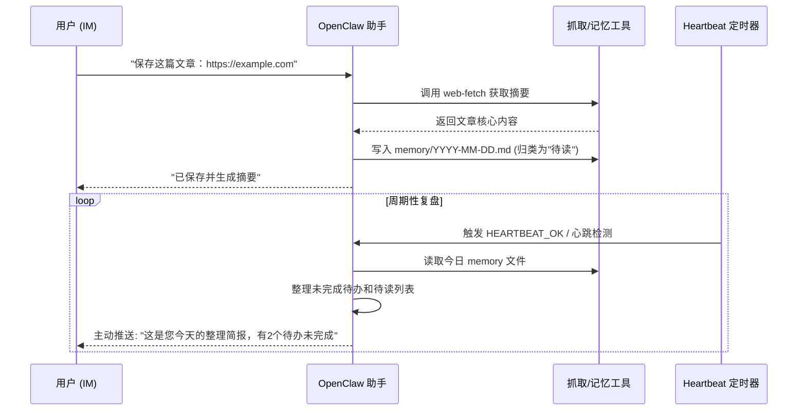

# 智能生活第二大脑：个人知识管理与待办自动化 (Intelligent Second Brain)

## Sources
- https://github.com/hesamsheikh/awesome-openclaw-usecases/blob/main/usecases/second-brain.md
- https://openclaw.ai/showcase

## 1. 应用场景 (Application Scenario)
在快节奏的现代生活中，人们每天都会接触到海量的信息、待办事项和灵感，但由于缺乏统一的收集和整理工具，导致这些碎片化信息很容易遗忘或难以追踪。
**痛点与挑战**：
- 用户需要在多个 App（备忘录、书签工具、任务管理软件）之间来回切换，体验割裂。
- 定期整理信息费时费力，缺乏自动化归档和智能检索能力。
- 难以根据收集到的信息进行主动的日程安排和事务跟进。

通过 OpenClaw 打造个人“第二大脑”，用户可以直接在通讯软件（如 Telegram 或 QQ）中发送链接、想法和待办事项，OpenClaw 会自动将这些内容分类整理，并利用 Heartbeat 机制进行定期的提醒和复盘。

## 2. 技术方案 (Technical Architecture/Solution)

本方案利用 OpenClaw 的长期记忆、技能扩展以及主动心跳机制构建全自动的个人知识库。

### 核心组件
- **Plugins/Skills**:
  - `web-fetch` & `web_search`: 自动抓取用户发送的链接内容并进行网页信息提取。
  - `memory_search` & `memory_get`: 管理和维护 `MEMORY.md` 以及 `memory/` 下的每日日志记录，实现信息的长期留存与检索。
  - 通讯通道集成（如 `qqbot-channel` 或 Telegram 接入）：实现信息的随时随地输入。
- **Heartbeat (心跳机制)**:
  - 扮演主动复盘和提醒的关键角色。配置心跳轮询策略（例如每两小时一次），OpenClaw 在收到 `HEARTBEAT` 触发时，会扫描最近记录在 `memory/YYYY-MM-DD.md` 中的“未处理待办”和“待读文章”。
  - 将处理结果通过通道主动发送给用户（如：每日晚间 21:00 进行总结归档提醒）。

### 工作流 (Workflow)

## 3. 实现效果 (Results/Outcomes)
**优点 (Pros)**：
- **无缝的信息收集**：无需打开特定的 App，在日常聊天的界面即可完成收集，极大降低了记录的心理门槛。
- **智能的主动跟进**：Heartbeat 机制有效解决了“只收集不处理”的知识管理通病，让助手像真人一样主动跟进。
- **上下文感知**：借助 `memory_search`，用户可以在日后以自然语言查询：“我上周存的那篇关于数据库设计的文章说了什么？”。

**不足与改进空间 (Cons & Improvements)**：
- **格式统一性**：由于内容来源广泛，存储到 Markdown 时的排版可能不一致，后续可考虑增加特定的清洗处理 Skill。
- **隐私性**：大量的个人日记或生活碎片依赖本地存储，需配合加密和备份方案确保数据安全。

## 4. 其他相关信息 (Other Info)
结合 OpenClaw 的 `cron` 定时任务系统，可以进一步扩充该方案。例如，针对长期未处理的待读链接，系统可以安排在每周六早晨自动执行一个专项回顾清理工作。