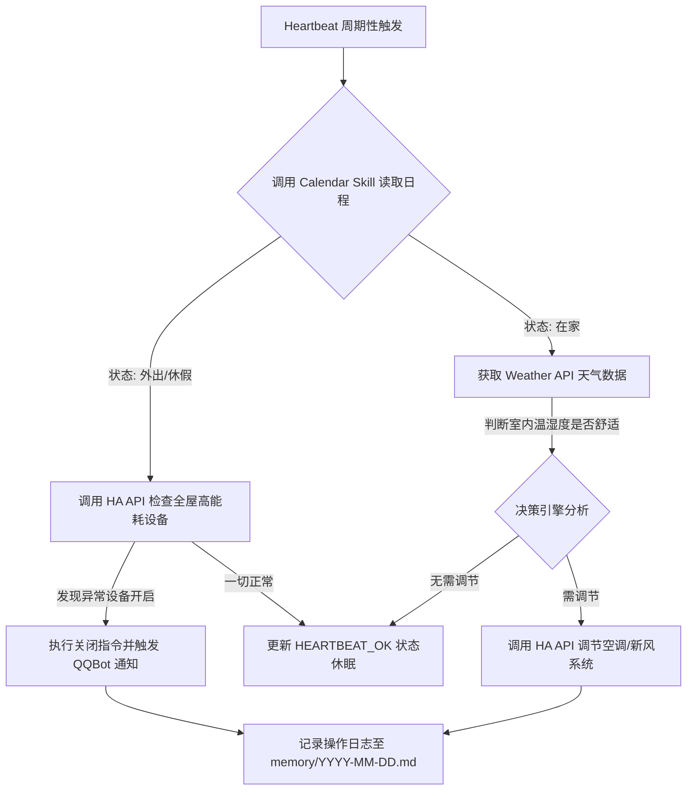

# IoT Smart Home Automated Energy & Routine Manager (智能家居能耗与作息自动化管家)

## Title
IoT Smart Home Automated Energy & Routine Manager (智能家居能耗与作息自动化管家)

## Sources
- GitHub - awesome-openclaw-usecases: [https://github.com/hesamsheikh/awesome-openclaw-usecases](https://github.com/hesamsheikh/awesome-openclaw-usecases)
- Forward Future AI 案例合集: [https://forwardfuture.ai/p/what-people-are-actually-doing-with-openclaw-25-use-cases](https://forwardfuture.ai/p/what-people-are-actually-doing-with-openclaw-25-use-cases)

## 1. 应用场景 (Application Scenario)
**背景与目的**：
随着家庭智能设备（如智能空调、热水器、灯光、安防摄像头等）的普及，用户通常依赖 Home Assistant 或米家等平台进行简单的“If-This-Then-That”自动化规则配置。然而，传统的自动化缺乏“上下文理解”能力。本场景旨在利用 OpenClaw 打造一个具备主动理解能力的“智能家居管家”。管家不仅能根据当前天气、电价波峰波谷进行设备调度，还能结合用户的日历日程（判断用户是否在家、是否在休假），自动规划家中设备的启停，从而实现真正的无感节能与舒适生活。

**痛点与挑战**：
1. 传统智能家居系统的规则配置过于死板，无法处理复杂的日程逻辑。
2. 难以实现跨系统（日历应用、天气 API、本地智能网关）的语义联动。
3. 用户希望获得自然语言的家居状态汇报，而不是冰冷的系统日志。

## 2. 技术方案 (Technical Architecture/Solution)
本方案充分利用了 OpenClaw 的本地部署能力、扩展技能包以及其独有的 Heartbeat（心跳机制）进行周期性状态巡检。

### 核心组件库与 Skills
- **`homeassistant-api` (Skill)**: 代理并调用本地 Home Assistant 的 REST API，负责收集温湿度传感器数据并下发控制指令。
- **`weather` (Skill)**: 获取当地实时天气与未来预报，决定是否需要提前开启空调除湿或制热。
- **`calendar` (Skill)**: 读取用户的 Google/Apple 日历，判断当前是否有外出的日程安排。
- **`qqbot-channel` (Skill)**: 作为主要的用户交互与通知界面，通过 QQ 频道或私信将重要警告和日报推送给用户。

### Heartbeat 配置与调度逻辑
OpenClaw 的 Heartbeat 机制是实现主动式管家的核心。
1. **配置文件 (`HEARTBEAT.md`)**: 定义了每 2 小时执行一次状态巡检的提示词规范。要求 OpenClaw 必须批量检查天气、日历与 HA 传感器。
2. **状态记录 (`memory/heartbeat-state.json`)**: 记录最后一次执行除湿、关闭高能耗设备的时间，避免频繁触发相同的操作。
3. **主动唤醒 (Wake Event)**: 若检测到高能耗设备（如电热毯、热水器）在“全家外出”状态下持续开启，立即阻断休眠并触发告警任务。

### 架构与工作流 (Mermaid Diagram)

## 3. 实现效果 (Results/Outcomes)
**优点 (Pros)**：
1. **高度智能化**：结合了大语言模型（LLM）的常识推理，推送的通知非常人性化。例如：“主人，检测到您有下午出差的日程，但次卧空调还在运行，我已经帮您关闭了，请安心出行。”
2. **隐私安全**：OpenClaw 直接与内网 Home Assistant 交互，敏感的家庭生活轨迹和视频监控等数据不经过外部公有云。
3. **低频高效**：Heartbeat 将多次状态检查合并在一个上下文中处理，大幅减少了对 API 和 LLM 接口的无意义调用（Token 损耗低）。

**缺点 (Cons) 与难点**：
1. 系统稳定性强依赖于本地服务器和 Home Assistant 实例的稳定运行。
2. 对于极高频的实时联动（如开门瞬间亮灯），OpenClaw 的心跳机制由于延迟原因无法替代 HA 自带的毫秒级本地联动规则，只能作为宏观层面的调度器。

**改进方向**：
- 未来可集成 `video-frames` 和 `image` 技能，当安防摄像头捕捉到异动时，由 OpenClaw 截取画面并主动分析判断是宠物还是入侵者，进一步减少误报。

## 4. 其他相关信息 (Other Info)
通过此案例可以看出，OpenClaw 不仅仅是一个聊天机器人，它配合 Cron、Heartbeat 与第三方外设接入，能轻松转变为一个拥有“主动意识”的本地中央处理枢纽。