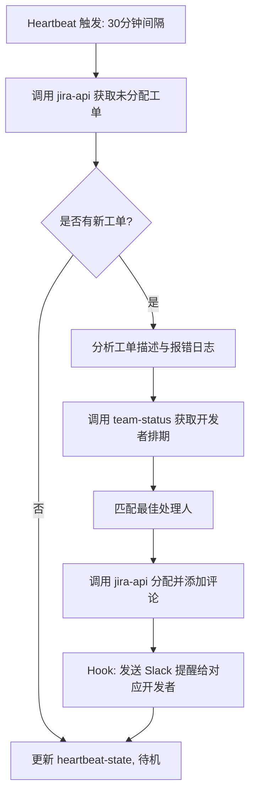

# Jira 工单自动分类与分配 (Automated Jira Ticket Triage & Assignment)

**Sources**: [AI Agents Kit - OpenClaw Use Cases](https://aiagentskit.com/blog/openclaw-use-cases/)

## 1. 应用场景 (Application Scenario)
**背景与目的**：
在日常的软件开发流程中，研发团队每天都会收到大量来自测试人员、产品经理或用户的 Jira 工单（Bug、需求、优化）。手动阅读、评估并分配这些工单不仅耗时，还容易由于分发错误导致解决延误。本案例旨在利用 OpenClaw 定期抓取未分配的 Jira 工单，通过语言模型理解其内容并自动匹配至合适的开发人员，从而提高团队研发效率。

**面临的挑战**：
- **上下文理解**：工单描述通常包含大量技术细节，简单的关键字匹配无法准确分类。
- **动态团队状态**：需要考虑各个开发人员的当前工作负荷及请假状态。
- **及时性与防漏报**：需要持续轮询，且不能遗漏或重复处理工单。

## 2. 技术方案 (Technical Architecture/Solution)
本方案主要利用定时器（Cron/Heartbeat）触发工单抓取，结合 Jira API 和内部团队数据库进行处理。

**核心组件配置**：
- **Skills**: 使用 `jira-api` 技能拉取和更新工单，使用 `team-status` 技能获取开发者当前负荷。
- **Plugins/Hooks**: 配置前置 Hook 在更新 Jira 时自动抄送通知至 Slack/企业微信。
- **Heartbeat**: 
  - 在 `HEARTBEAT.md` 中配置心跳任务，每 30 分钟触发一次“检查未分配的 Jira 待办事项”。
  - 将处理状态记录到 `memory/heartbeat-state.json`，确保断电重启后不会丢失抓取进度。

**工作流设计**:

## 3. 实现效果 (Results/Outcomes)
**优点**：
- **效率提升**：将平均工单分配时间从原来的数小时缩短至 5 分钟内。
- **负载均衡**：有效避免了将过多 Bug 分配给同一个资深开发，结合排期状态做到了动态均衡。

**缺点**：
- **准确性依赖模型**：对于跨业务线或描述过于模糊的工单，模型有时会分配给错误的技术主管。

**改进方向**：
- 引入“置信度”机制，低于一定阈值的分配建议由人工二次确认。
- 联动 Git 提交记录，让 Agent 知道谁最近修改过出错模块的代码。

## 4. 其他相关信息 (Other Info)
- 建议将 Jira API Token 设为安全环境变量，不要写入普通内存日志中。
- 可以使用高上下文模型，它们在阅读代码和报错堆栈时具有极高的准确性。