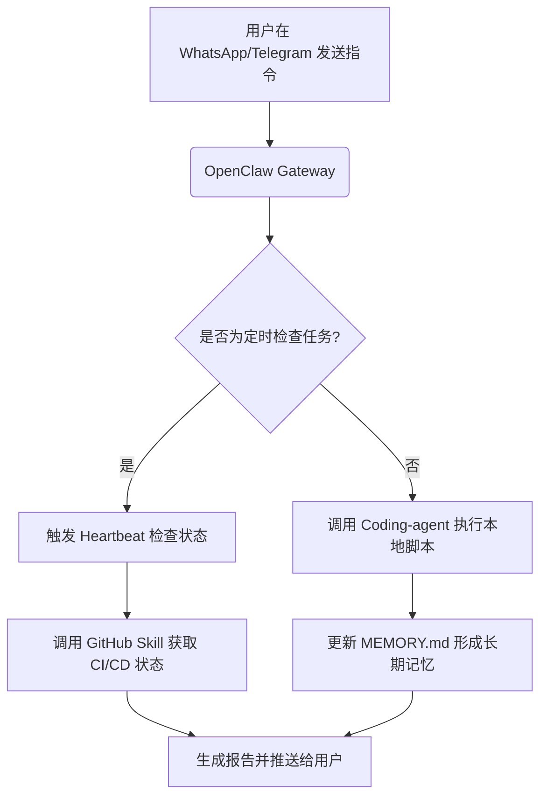

# 报告：OpenClaw 开发者个人自动化与智能助理方案

**Title**: OpenClaw 开发者个人自动化与智能助理方案
**Sources**: https://www.digitalocean.com/resources/articles/what-is-openclaw

## 1. 应用场景 (Application Scenario)
**背景与目的**：
随着开发者个人日常任务和技术管理工作流（如 DevOps 监控、代码审查、日程管理）的复杂化，亟需一个"永远在线 (Always-On)"的个人 AI 助理。此用例旨在利用 OpenClaw 构建一个能无缝连接本地资源与外部通讯工具（如 WhatsApp/Telegram/Discord）的 24/7 个人 AI 代理，实现代码自动构建、智能日程规划、以及跨平台的自动化运维管理。

**面临的挑战与困难**：
- **上下文割裂**：传统 AI 无法记忆多平台之间的长程对话或自动整合本地系统文件状态。
- **缺乏主动性**：传统工具通常是被动响应式，而我们需要助理能**主动**提醒并执行构建脚本。
- **环境安全限制**：在本地执行 shell 脚本及自动化浏览器操作存在安全隐患，需要受控沙箱或严格的安全审计。

## 2. 技术方案 (Technical Architecture/Solution)
本方案在本地服务器（或 VPS 如 DigitalOcean Droplet）部署 OpenClaw，并将其挂载至常用即时通讯平台，实现跨设备调度能力。

### 核心组件配置

- **Skills (技能)**:
  - `coding-agent`：后台生成代码，并使用 `sessions_spawn` 自动拉起子 Agent 处理复杂的重构任务。
  - `github`：获取 PR 状态及 CI 运行日志。
- **Plugins (插件)**:
  - 接入第三方 Chat App 插件（如 Telegram/Discord Gateway），使终端用户能够随时发起指令。
- **Heartbeat (心跳机制)**:
  - 设定定期 Heartbeat（例如每 30 分钟轮询），检查 `memory/heartbeat-state.json` 中的定时任务状态。
  - 当 Heartbeat 触发时，主动检查是否有失败的 GitHub Actions 任务，如有则通过 Chat App 发送提醒给用户。

### 工作流模型 (Workflow)

## 3. 实现效果 (Results/Outcomes)
**优势 (Pros)**：
- **全天候主动服务**：基于 Heartbeat 的主动轮询实现了“人休机不休”，极大提升了 DevOps 响应速度。
- **跨平台融合**：从聊天软件直接下发终端指令，体验自然顺畅，降低了多工具切换的认知负荷。

**不足与改进点 (Cons & Areas for Improvement)**：
- 对沙箱外环境操作的鉴权管理需要非常细致，防止误操作删除本地关键文件。
- Heartbeat 的频率如设置过高，可能消耗较多底层 LLM Token 成本，建议组合 Cron Job 执行特定精确任务。

## 4. 其他相关信息 (Other Info)
- **环境建议**：推荐通过安全加固的 1-Click OpenClaw Deploy 镜像部署，或者在配置严格读写权限的沙箱中执行。
- **拓展可能**：可进一步结合 `web-hybrid-search` 技能，使 OpenClaw 在排查 Bug 时自动搜寻最新的 StackOverflow 或官方文档并给出修复建议。