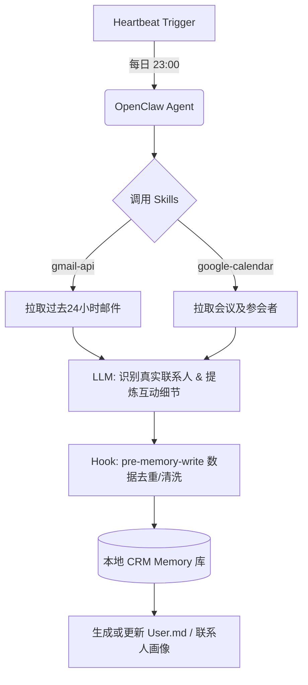

# 个人 AI 客户关系与互动历史画像构建 (Personal CRM & Interaction Profiler)

## Sources
- https://medium.com/the-ai-studio/11-insane-use-cases-of-openclaw-ai-a341e997a57f

## 1. 应用场景 (Application Scenario)

**背景与目的：**
在现代商业和社交环境中，人们每天都会通过邮件、会议和即时通讯工具与大量的联系人进行沟通。然而，手动管理这些零散的互动记录并提炼出有价值的联系人画像（如对方的职位、公司、历史交流重点、个人偏好等）不仅耗时，而且极易遗漏关键细节。
此应用场景旨在利用 OpenClaw 自动化扫描和分析用户的收件箱及日历，自动过滤掉订阅邮件和垃圾信息，为每一位真实联系人建立并持续更新动态的个人 CRM 画像。

**面临的挑战：**
- **数据噪音**：收件箱中充斥着大量的时事通讯、系统通知和营销邮件，需要精准区分“真实联系人”与“机器人”。
- **上下文关联**：需要跨平台（如从 Gmail 到 Google Calendar）关联同一个人或同一家公司的互动时间线。
- **隐私与安全**：在处理高度敏感的个人通讯记录时，确保数据仅在本地或受信任的隔离环境中处理，防止信息泄露。

## 2. 技术方案 (Technical Architecture/Solution)

为了实现自动化的个人 CRM，系统整合了多个核心组件，通过 Heartbeat 机制实现无感知的后台持续更新。

**核心组件使用：**
- **Skills (技能)**:
  - `gmail-api`: 用于获取最新邮件，过滤非人类发件人。
  - `google-calendar`: 拉取历史和未来的会议记录，提取参会者列表。
  - `memory-manager`: 将提取出的联系人画像信息持久化到本地 `memory/crm/` 目录下。
- **Heartbeat (心跳)**:
  - 配置每日晚间（如晚上 23:00）触发 `crm-update` 任务，扫描过去 24 小时内的新增通讯记录并增量更新画像。
- **Plugins/Hooks**:
  - `pre-memory-write` hook: 在写入画像数据前，进行数据脱敏和去重。

**技术架构图 (Mermaid):**



**Heartbeat 配置示例：**
```json
{
  "name": "Daily CRM Profiler",
  "schedule": { "kind": "cron", "expr": "0 23 * * *", "tz": "Asia/Shanghai" },
  "payload": {
    "kind": "systemEvent",
    "text": "Scan Gmail and Google Calendar for the past 24 hours. Extract real contacts, summarize our interactions, and update their profiles in memory/crm/. Ignore newsletters."
  }
}
```

## 3. 实现效果 (Results/Outcomes)

**优势 (Pros)：**
- **全自动化**：无需手动录入 CRM 系统，AI 自动在后台提炼关键沟通节点。
- **极高的会议准备效率**：在下一次开会前，用户只需询问 OpenClaw “我之前和 John 聊过什么”，即可瞬间获得完整的交互时间线。
- **精准的上下文记忆**：有效解决由于时间久远导致的“聊过但忘了细节”的尴尬局面。

**局限性 (Cons)：**
- **API 限制**：频繁拉取邮件和日历可能会触发 Google API 的 Rate Limit。
- **理解偏差**：对于包含隐喻、讽刺或高度专业术语的邮件，LLM 可能会提取出错误的联系人偏好。

**改进空间：**
- 引入向量数据库（如 ChromaDB/Qdrant）来替代纯文本的 `memory/crm/` 存储，从而支持对海量互动记录的语义检索。
- 增加与 WhatsApp 或 Telegram 消息记录的整合，形成全渠道的联系人画像。

## 4. 其他相关信息 (Other Info)

- **安全建议**：建议在执行此用例时，严格限制 OpenClaw 的网络外发权限（使用 `security="deny"` 模式运行敏感数据的处理进程），确保联系人数据不会被传输到未经授权的第三方服务器。
- **数据保留策略**：建议配置自动清理策略（如仅保留核心摘要，删除原始邮件正文），以控制本地存储空间的占用。