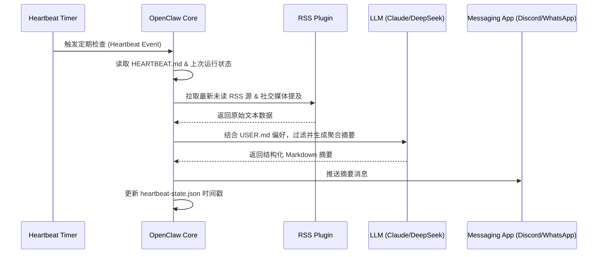

# 个人 RSS 摘要与社交媒体监控自动化 (Personal RSS Digest & Notification Automation)

## Sources
- https://openclaw.ai/
- https://github.com/hesamsheikh/awesome-openclaw-usecases

## 1. 应用场景 (Application Scenario)

**背景与目的**：
在信息爆炸的时代，个人需要每天浏览大量的 RSS 订阅源、社交媒体（如 Twitter）和行业新闻。手动筛选这些信息既耗时又容易遗漏关键内容。此应用场景旨在利用 OpenClaw 作为全天候个人 AI 助手，自动收集、过滤并总结用户感兴趣的资讯，随后通过即时通讯工具（如 WhatsApp、Discord 或微信）向用户推送定制化的摘要信息。

**面临的挑战**：
- **信息过载**：需要处理海量非结构化文本，去重并提取有价值的信息。
- **及时性**：必须定期检查更新，而不是依赖用户手动触发。
- **上下文感知**：助手需要了解用户当前的偏好，甚至与用户的日程表结合，在用户方便的时间段（如通勤时）推送。

## 2. 技术方案 (Technical Architecture/Solution)

本方案主要依托 OpenClaw 的 **Skills**、**Plugins**、**Hooks** 以及 **Heartbeat** 机制来实现全自动的资讯流转。

### 核心组件配置

- **Skills**:
  - `web-fetch`: 用于抓取特定网页或 RSS 源的具体内容。
  - `summarizer`: 用于将长篇文章压缩为要点。
- **Plugins**:
  - `rss-reader`: 定时拉取 RSS feed。
  - `discord-bot` 或 `whatsapp-integration`: 用于将生成的摘要发送到用户的移动设备。
- **Heartbeat (心跳机制)**:
  - 核心驱动力。在 `HEARTBEAT.md` 中配置了定时检查逻辑。例如，设定每两小时触发一次 Heartbeat 轮询。
  - **触发逻辑**：当 Heartbeat 触发时，系统会读取上次检查的时间戳（存储在 `memory/heartbeat-state.json` 中），拉取这段时间内的所有新 RSS 摘要。

### 架构与工作流 (Mermaid Diagram)

## 3. 实现效果 (Results/Outcomes)

**优点**：
- **高度个性化**：得益于 `USER.md` 和 `MEMORY.md`，助手清楚知道用户关心的细分领域（如特定公司的财报或特定的开源项目），从而精准过滤噪音。
- **无感自动化**：借助 Heartbeat 组件，整个过程无需用户主动发起对话。消息会在设定好的“阅读时间”自动推送到手机。
- **高可扩展性**：可以随时通过修改 `HEARTBEAT.md` 增加新的数据源或改变推送频率，无需修改代码。

**改进空间**：
- 在极端情况下，如果有突发新闻，基于固定间隔的 Heartbeat 可能不够及时，未来可引入 Webhook 实时触发（Hooks）来处理紧急资讯。

## 4. 其他相关信息 (Other Info)

- 用户可通过自然语言在聊天软件中对助手说：“把关于 AI 的新闻频率调整为每天一次”，OpenClaw 将自动修改 `HEARTBEAT.md` 或配置状态文件。
- 此案例证明了 OpenClaw 不仅是一个被动的问答机器人，更是一个具备自主调度能力的“代理端 (Agentic Interface)”。