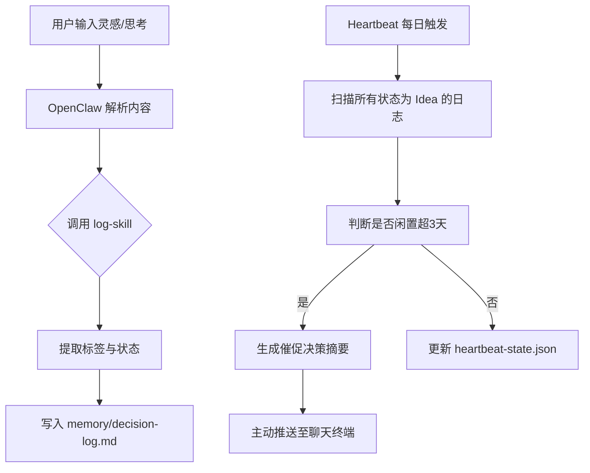

# 个人知识管理与决策日志追踪系统 (PKM Decision Logger)

## Sources
- https://openclaw.ai/showcase

## 1. 应用场景 (Application Scenario)
### 背景
在快节奏的日常工作与生活中，人们每天都会产生大量的创意（Ideas）、灵感以及需要做出的决策。但这些碎片化的思考往往缺乏系统性的追踪机制，导致“想得多、做得少”，或者在回顾过去的决策时遗忘当时的推演逻辑。

### 目的
开发一套基于 OpenClaw 的个人知识管理与决策日志追踪自动化系统。用户可以随时通过微信、Telegram 或命令行将碎片化的思考发给 OpenClaw，系统会自动归档分类，将其从“灵感”阶段追踪到“决策”或“归档”阶段。

### 痛点与挑战
- **跨平台输入：** 灵感往往在不同场景下产生，需要无缝的跨终端记录。
- **状态追踪：** 创意需要经历“孵化 -> 评估 -> 决策”的状态流转。
- **定期复盘：** 多数人难以坚持周期性复盘，需要系统主动在合适的时间进行提醒和归纳总结。

## 2. 技术方案 (Technical Architecture/Solution)

本系统充分利用了 OpenClaw 的长期记忆库（Memory）、多端接入插件（Plugins）、自定义技能（Skills）以及周期性心跳触发（Heartbeat）来实现全自动化追踪。

### 核心组件
1. **Plugins (插件层):**
   - 接入了 Telegram 插件或 WeChat Hook，允许用户通过移动端发送语音或文字日志。
   - 使用 `markdown-writer` 插件，负责精准读写本地工作区的文件。
2. **Skills (技能层):**
   - **`log-skill`**: 一个自定义技能，专门解析用户的输入并提取标签（Tags）、项目（Project）和当前状态（State: Idea/Draft/Decision）。
3. **Heartbeat (心跳/调度层):**
   - 配置为每日晚 10:00 执行一次 Heartbeat。
   - **Heartbeat 逻辑**:
     - 读取当天新记录的日志节点。
     - 分析卡在 "Idea" 阶段超过 3 天的内容，生成**每日待定决策清单**。
     - 若 `heartbeat-state.json` 中的 `lastSummary` 与今天相差 24 小时，则主动通过主会话向用户推送总结报告。

### 工作流 (Workflow)

## 3. 实现效果 (Results/Outcomes)

### 优点 (Pros)
- **极大地降低了记录门槛**：只需一句话，所有的分类、标签、归档操作均由 AI 自动完成。
- **主动式跟进**：借助 Heartbeat 功能，OpenClaw 会主动敦促用户做决定，扮演了“个人项目经理”的角色。
- **数据本地化与隐私**：所有决策记录均存储在 `~/.openclaw/workspace/memory/` 中，不依赖第三方云笔记服务，安全可控。

### 缺点与改进空间 (Cons & Improvements)
- **缺点**：对于复杂的思维导图或层级式逻辑支持较弱，目前仍以线性 Markdown 文本为主。
- **改进**：未来可以集成图谱生成插件，将独立的决策节点通过双向链接串联，形成知识图谱，并将其推送到 Obsidian 或 Logseq 中进行可视化。

## 4. 其他相关信息 (Other Info)
- **部署要求**: OpenClaw v0.5.0+ 
- **依赖配置**: 需要配置对应的聊天机器人的 Token (如 Telegram Bot Token) 以实现无缝输入。
- 该场景适合作为自由职业者、创业者、以及独立开发者的日常助理标配方案。
