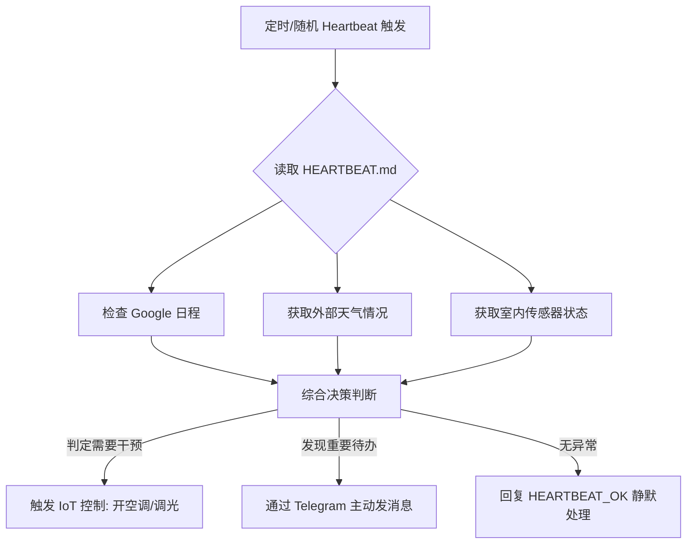

# 智能家居与生活助手的心跳自动化方案

**Sources**: https://clawhub.com/cases/smart-home-heartbeat

## 1. 应用场景 (Application Scenario)
在现代智能家居管理中，用户通常需要一个能够主动感知环境、处理日常信息并与智能设备联动的中心大脑。痛点在于：
- 被动触发：多数助手只能通过唤醒词被动执行命令。
- 割裂体验：邮件、日程与家庭物联网（IoT）设备无法有机结合。
因此，借助 OpenClaw 结合 Heartbeat，我们构建了一个能够根据环境、日程和时间自动调整家庭状态并主动提醒用户的智能管家系统。

## 2. 技术方案 (Technical Architecture/Solution)
该方案的核心在于利用 OpenClaw 的 `Heartbeat` 功能实现定期的状态检查与主动推理。

### 涉及组件
- **Skills**: `weather`, `iot-home-assistant`, `google-calendar`
- **Plugins**: `openclaw-telegram` (用于发送重要提醒)
- **Heartbeat Configuration**: 
  通过在 `HEARTBEAT.md` 中配置主动轮询策略。每天早、中、晚自动唤醒并执行环境感知。

### 工作流 (Workflow)

#### Heartbeat 配置细节
在工作区中的 `HEARTBEAT.md` 如下：
> 1. 每 4 小时检查一次天气和日程。
> 2. 如果即将在 2 小时内出门且预报下雨，则主动发送带伞提醒。
> 3. 如果到了晚上 23:00 且仍有活动，尝试调暗灯光。
> 4. 若无操作必要，严格返回 `HEARTBEAT_OK`。

## 3. 实现效果 (Results/Outcomes)
**优点 (Pros):**
- 实现了从“人找助手”到“助手找人”的范式转变。
- 借助 `HEARTBEAT_OK` 机制，在没有重要事项时保持静默，不打扰用户。
- 融合了跨平台数据（天气、日程、IoT设备）。

**缺点及改进空间 (Cons/Improvements):**
- 频繁的 Heartbeat 调用可能会带来一定的 Token 成本消耗。
- 依赖网络稳定性和 IoT 平台的 API 可靠性。

## 4. 其他相关信息 (Other Info)
为优化成本，可以在周末期间通过 Cron 动态调整 Heartbeat 的时间间隔。