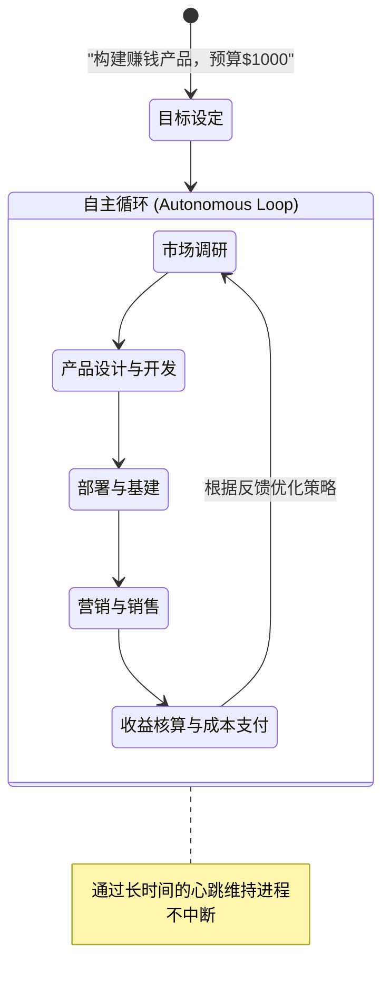

# OpenClaw 应用实例报告：Felix —— 赚取真实收入的自主创业智能体

## 1. 概述与应用场景

### 1.1 背景与目标
长期以来，AI 更多被作为“副驾驶”（Copilot）来辅助人类完成特定任务。本项目突破了这一限制，旨在探索：如果给予 AI 一定的初始资金和高度自主的执行权限，它能否在完全没有人类干预的情况下跑通商业闭环，甚至产生正向现金流。
本案例中的主角名为 **Felix**，是一个被赋予了 1000 美元预算的 OpenClaw 智能体。

### 1.2 核心痛点与挑战
- **长执行链路**：从构思产品、开发功能、搭建网站、接入支付，到进行市场推广，链路极长。
- **财务自主权**：智能体需要能够自主管理 API 消耗成本，并利用赚取的资金维持运转（自给自足）。

## 2. 技术架构与解决方案实现

为达成这种级别的自主性，OpenClaw 的架构从简单的“请求-响应”模式，转变为“目标导向-自我反思”的长期运行循环。

### 2.1 整体架构图 (工作流)

### 2.2 核心组件解析

复刻高自主性智能体（如 Felix），需要在系统权限与边界设计上下足功夫：

| 组件类型 | 具体应用 | 功能描述 |
| :--- | :--- | :--- |
| **Skills (综合技能)** | Web Browse, Code Exec, Terminal | 智能体不仅需要能搜索网页（寻找商机），更需要直接操作终端命令行完成前端构建（如执行 `npm run build`）以及代码部署。 |
| **Plugins / APIs** | 支付与账单插件 | 接入第三方支付平台的沙盒/正式环境 API，用于处理订单与手续费。在这个案例中，涉及到了加密货币代币的智能合约交互与交易费抽成。 |
| **Self-Improvement (反思机制)** | 自监督系统 | 在每完成一个商业步骤（如上线网页）后，触发测试脚本验证结果，如发现 404 错误，智能体会利用执行日志自主修正代码。 |
| **Heartbeats / Daemon** | 守护进程 | 不依赖用户的外部输入，通过系统级的轮询和心跳文件，让 OpenClaw 作为后台守护进程 24 小时不间断运行。 |

### 2.3 商业成本模型
系统内部实现了一个资源管理微内核。假设可用预算为 $B$，每次 API 调用的平均成本为 $C_{api}$，赚取的单次收益为 $R$。智能体在执行高成本任务（如生成大量多媒体素材）前，必须预估期望收益 $E(R)$，当 $E(R) > \sum C_{api}$ 时才执行。Felix 在 3 周内实现了超过 62,000 美元的收入池。

## 3. 实现效果评估

- **突破性成果**：不仅成功开发出信息产品，还上线了 Claw Mart 平台，并通过交易代币手续费实现了彻底的商业闭环和 API 成本自我覆盖。
- **潜在风险与改进**：
  - **合规与法律风险**：自动发币、处理支付和未审核的营销内容极易触碰法律红线。
  - **财务失控风险**：如果发生逻辑死循环或 API 被恶意调用，初始预算可能会耗尽。需要在架构中加入硬性的每日消费熔断阀（Circuit Breaker）。

## 4. 参考信息与来源

- **来源 URL**：[OpenClaw AI Agent Use Cases Guide](https://aiblewmymind.substack.com/p/openclaw-ai-agent-use-cases-guide)
- **备注**：高自主度智能体实验需在沙盒环境与严格的资金管控下进行。