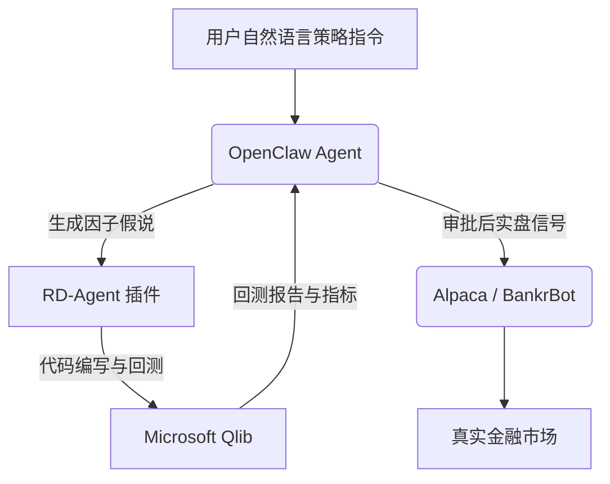

# OpenClaw AI 交易与量化投资应用集成 (OpenClaw AI Trading & Quant Skills)

## Sources
- https://aurpay.net/aurspace/openclaw-ai-trading-skills-complete-guide-2026/

## 1. 应用场景 (Application Scenario)
**背景与目的**：
随着 OpenClaw 生态的爆发，大量金融与加密货币投资者开始尝试将其用作全天候的自动化交易和市场监控代理。传统的量化交易需要编写复杂的 API 脚本，而本用例旨在利用 OpenClaw 的自然语言理解能力，结合金融类专用插件（Skills），实现从股票买卖、加密货币现货/DeFi 操作、预测市场（Polymarket）套利，到复杂的量化回测流水线的全自动化。

**困难与挑战**：
- **安全与资金风险**：授予 AI 代理真实的资金操作权限存在巨大风险，尤其是在生态系统遭遇过供应链投毒（如 ClawHavoc 事件）的背景下。
- **执行延迟与滑点**：大语言模型的推理时间与高频交易（HFT）对毫秒级响应的需求存在天然冲突。
- **缺乏风控限制**：基础的 OpenClaw 缺乏原生的交易限额或止损逻辑，需要通过特定的架构或护栏来兜底。

## 2. 技术方案 (Technical Architecture/Solution)
在金融应用场景下，OpenClaw 主要作为“执行编排层”，通过连接第三方专业交易 API/插件来完成任务。以下是几种典型的工作流架构：

### 核心交易栈 (Trading Stacks)
1. **加密货币全能交易 (BankrBot 架构)**：
   - 使用 `@bankr/cli` 或 `bankr` 技能。
   - **工作流**：用户输入自然语言 -> OpenClaw 调用 Bankr LLM 网关解析意图 -> 在 Base/Solana 等多链发起链上交易。
   - **关键配置**：需通过 Privy 嵌入式钱包管理非托管密钥，并配合 `BANKR_API_KEY` 使用。
2. **预测市场套利 (Polyclaw 架构)**：
   - 使用 `polyclaw` 技能直连 Polymarket 的中央限价订单簿 (CLOB)。
   - 依赖 Node/Python 脚本自动批准智能合约，结合 OpenRouter 的外部大模型进行概率对冲发现。
3. **传统美股/期权 (Alpaca 架构)**：
   - 部署官方的 `alpaca-mcp-server`，利用 MCP (Model Context Protocol) 协议连接 OpenClaw。
   - 能够基于条件轮询市场数据（例如：“如果 NVDA 跌超 5%，则平仓一半”）。

### 架构示意图 (以量化回测与执行为例)

## 3. 实现效果 (Results/Outcomes)
**优势 (Pros)**：
- **极简的策略表达**：将编写 API 调用代码的门槛降维至自然语言对话，对普通投资者非常友好。
- **跨平台融合**：能够在同一个上下文中同时监控美股（Alpaca）、预测市场（Kalshi/Polymarket）和加密资产的异动。

**劣势与改进空间 (Cons & Areas for Improvement)**：
- **收益率严重失真**：许多社区宣称的“59% 年化”仅为理想情况下的回测数据，未计入滑点和交易摩擦。
- **套利窗口极窄**：在预测市场中，API 套利窗口已压缩至 2.7 秒甚至更低，AI 代理的处理延迟很难与专业的 HFT 机器抗衡，73% 的利润仍被 HFT 捕获。
- **安全性薄弱**：API 密钥常明文存储于 `~/.openclaw/` 目录下，极易成为恶意插件窃取的目标。

## 4. 其他相关信息 (Other Info)
- **安全加固建议**：在执行任何涉及真实资金的交易前，强烈建议将 OpenClaw 运行在非 Root 的受限 Docker 容器中；必须配备 ClawSecure 或 ClawScan 等扫描工具检测恶意插件；并始终从受限制的纸上交易（Paper Trading）账户开始测试。
- **监管合规**：使用 AI 执行洗盘、挂单欺诈（Spoofing）等行为同样会触发 SEC/FINRA 的违法认定，工具的智能化并不能豁免合规责任。