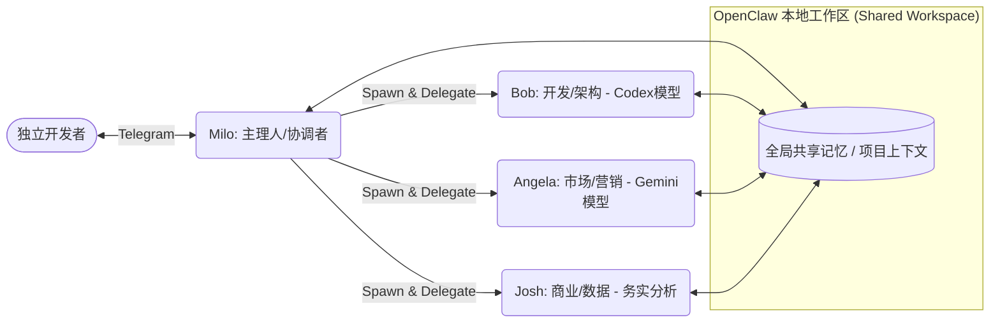

# OpenClaw 应用实例报告：Solo Founder 的全天候虚拟团队架构

## 1. 概述与应用场景

### 1.1 背景与目标
独立开发者（Solo Founder）在启动创业项目时，面临的最大瓶颈是“带宽不足”。一个人必须同时扮演 CEO（制定战略）、CTO（编写代码与架构）、CMO（市场调研与内容营销）以及 CFO（商业指标分析）。频繁的角色切换会导致极高的认知负担。
此应用旨在利用 OpenClaw 的 **Subagents（子智能体）** 功能，构建一个“7x24小时全天候运转的虚拟团队”，分担繁重的日常运营和开发工作。

### 1.2 核心痛点
- 任务上下文经常丢失：从写代码突然切换到写营销文案时，容易遗忘细节。
- 并行处理能力差：无法一边进行代码重构，一边抓取竞品情报。

## 2. 技术架构与解决方案实现

该解决方案的核心在于构建一个**多智能体协作网络（Multi-Agent Network）**，每个角色由专一配置的子智能体承担。

### 2.1 整体架构图 (工作流)

### 2.2 核心组件解析

想要复刻该架构，开发者需要掌握以下 OpenClaw 组件的配置：

| 组件类型 | 角色分配 | 描述与配置要点 |
| :--- | :--- | :--- |
| **Subagents (子智能体)** | Milo, Bob, Angela, Josh | 使用 `sessions_spawn` 接口生成不同的隔离会话 (`runtime="subagent"`)，为它们配置不同的人格 (System Prompt) 和最匹配的模型（如写代码用 Codex，写文章用 Gemini）。 |
| **Memory (共享记忆)** | 全局上下文 | 所有的 Subagents 都共享根目录下的 `MEMORY.md` 及其它项目级文档。这保证了市场部门 (Angela) 能了解开发部门 (Bob) 最新上线的功能。 |
| **Heartbeats (心跳机制)** | 主动监控与干预 | 配置 `HEARTBEAT.md`。例如让 Angela 每隔 4 小时执行一次心跳，自动监控 Reddit 和 Twitter 相关竞品关键词。 |
| **Cron (定时任务)** | 自动化输出 | 设定每日凌晨自动触发，让 Josh 读取昨天的数据并生成一份业务报表，Milo 将各部门进度汇总，清晨推送到用户的 Telegram。 |

### 2.3 决策分发逻辑
主智能体 (Milo) 充当路由器。当用户输入：“我们需要针对最新的 API 优化一下定价页面和底层代码”时，Milo 会利用 $P(Task | Context)$ 将任务分割为前端文案任务和后端代码任务，分别并行下发给 Angela 和 Bob。

## 3. 实现效果评估

- **效率提升**：实现了真正的“人机并行”。开发者在睡觉时，营销智能体依然在处理 Reddit 的线索，开发智能体在重构冗余代码。
- **专业化输出**：因为为不同任务分配了最优的大模型，输出质量显著高于使用单一模型处理所有任务。
- **可改进空间**：多智能体协作容易产生“幻觉循环”（Hallucination Loops），比如两个智能体对某个技术方案产生分歧并在后台反复争论。需要通过设定严格的退出条件（Timeout/Max Steps）和人工介入点来控制。

## 4. 参考信息与来源

- **来源 URL**：[OpenClaw Showcase - What People Are Building](https://openclaw.ai/showcase)