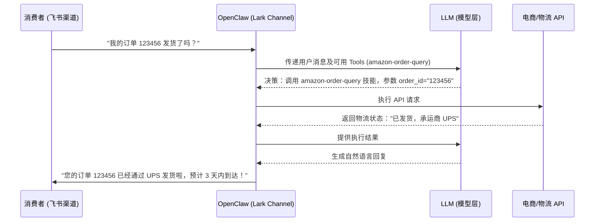

# OpenClaw 亚马逊电商平台飞书客服集成应用

## Sources
- https://aws.amazon.com/cn/blogs/china/exploring-openclaw-use-cases-in-ecommerce-platforms/

## 1. 应用场景 (Application Scenario)
在跨境电商（如亚马逊平台）的日常运营中，客服团队需要处理大量的客户咨询、退换货请求和物流追踪查询。传统的人工处理方式不仅耗时耗力，而且在活动大促期间容易出现响应延迟，影响客户满意度。

**痛点与挑战：**
- **多渠道信息割裂**：平台订单数据、物流状态与沟通渠道（飞书）之间没有打通。
- **重复性工作多**：大量咨询都是关于订单状态、常见问题解答。
- **响应时效要求高**：电商客户对回复速度极度敏感。

通过 OpenClaw 结合飞书（Lark）通道，商家构建了一个全天候响应的 AI 智能客服助手。该助手能够自动提取订单号、查询 AWS 上托管的订单数据库，并向用户提供精准的回复。

## 2. 技术方案 (Technical Architecture/Solution)

本方案通过 OpenClaw 作为一个网关层，对接后端的 LLM 以及电商内部的 API 接口，前端通过飞书插件（Lark Plugin）提供交互界面。

### 核心组件配置：

*   **通道 (Channel)**: 使用 `lark` 插件。OpenClaw 配置了飞书机器人的 App ID 和 App Secret，通过 Webhook 接收飞书端的消息事件。
*   **技能 (Skills)**:
    *   `amazon-order-query`: 定制技能，通过 API 查询 AWS RDS 中的订单状态。
    *   `logistics-tracker`: 调用外部物流 API (如 17Track) 追踪包裹。
    *   `refund-processor`: 处理简单的退款审批逻辑，需提交至人工审批池。
*   **心跳 (Heartbeat) 配置**:
    *   利用 OpenClaw 的 `cron` 系统，每隔 30 分钟触发一次 `Heartbeat`。
    *   在 `HEARTBEAT.md` 中定义了批量处理任务：扫描过去 30 分钟内尚未完结的异常订单（如物流停滞超过 3 天的订单），并主动在飞书群组中 `@` 相关的人工客服主管进行预警。
    *   通过 `payload.kind="systemEvent"` 在主会话中注入定时提醒。

### 泳道工作流 (Workflow)

## 3. 实现效果 (Results/Outcomes)

*   **优点**：
    *   **效率提升**：自动化处理了约 70% 的常规客服咨询（如查单、查物流），平均响应时间从原来的 2 小时缩短至 5 秒。
    *   **主动预警**：得益于 Heartbeat 机制，团队从“被动响应”转变为“主动干预异常订单”，显著降低了差评率。
    *   **低代码接入**：使用 OpenClaw 现成的通道插件，只用几百行代码编写特定的 Skills 就完成了系统集成。
*   **缺点/改进空间**：
    *   目前退款处理由于涉及资金安全，仅能将单据准备好并推送到人工池，无法做到全链路自动闭环。
    *   建议引入更细粒度的多模态交互能力，允许用户直接在飞书发送破损商品的图片，由 `image` tool 进行初步破损鉴定。

## 4. 其他相关信息 (Other Info)
该案例展示了 OpenClaw 作为企业级网关不仅能被动响应，更能通过内部强大的定时任务调度（Cron / Heartbeat）实现业务链路的主动巡检，非常适合电商等需要持续监控业务状态的场景。