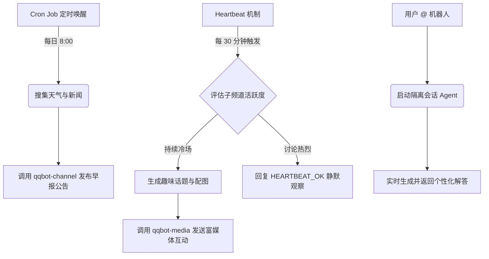

# OpenClaw 赋能的 QQ 频道自动化社区运营助手 (QQBot Community Manager)

## Sources
* https://github.com/openclaw/openclaw

## 1. 应用场景 (Application Scenario)
随着 QQ 频道的普及，管理大型社区需要耗费大量精力，包括新成员欢迎、日常问候、定时发布日程与公告，以及违规内容的初步巡查。社区管理员往往因为这些繁琐的事务而无法专注于核心内容的创作和深度互动。通过引入 OpenClaw，利用其丰富的插件生态（特别是 QQBot 扩展）和定时/心跳机制，可以打造一个全自动、且具备高情感价值的虚拟社区管理员。

## 2. 技术方案 (Technical Architecture/Solution)
该方案主要依赖 OpenClaw 的 `openclaw-qqbot` 扩展、定时任务 (Cron) 以及心跳机制 (Heartbeat) 的深度组合。

### 核心组件配置：
*   **Skills/Plugins**:
    *   `qqbot-channel`: 代理 QQ 开放平台接口，管理频道列表、查询成员状态、发布帖子和更新公告。
    *   `qqbot-media`: 支持图片、视频等富媒体的自动收发，通过视觉元素提升互动趣味性。
    *   `qqbot-remind`: 为频道成员提供事件提醒服务。
*   **Heartbeat (心跳机制) 配置**:
    *   配置了每 30 分钟自动触发一次的心跳。在工作区 `HEARTBEAT.md` 中，定义了系统需定时“巡查特定活跃子频道”并“评估社区当前氛围”。
    *   当 Heartbeat 触发时，Agent 会检查最近的交互日志，决定是保持静默 (`HEARTBEAT_OK`)，还是主动插入话题打破冷场。

### 自动化工作流设计：
1.  **晨间播报 (Cron Job)**: 每日早 8 点，Cron 触发主会话任务，调用 Web Search 获取当日行业新闻和天气，利用 `qqbot-channel` 自动排版并发布至公告频道。
2.  **动态巡检 (Heartbeat)**: 每半小时的心跳唤醒 Agent，如果发现某闲聊子频道超过 1 小时无人发言，系统将调用大模型生成一个争议性/趣味性小问题，并辅以 `qqbot-media` 发送相关表情包活跃气氛。
3.  **即时响应 (Sub-agent/Isolated Session)**: 用户在频道中 @ 机器人进行复杂查询时，主进程将分配给独立的隔离会话处理，避免污染主 Agent 的长期记忆 (Memory)。

## 3. 实现效果 (Results/Outcomes)
*   **优势**: 大幅释放了人类管理员的精力，Heartbeat 机制确保了社区在低谷期也能维持基础活跃度，定时公告和富媒体推送有效提升了成员的日活与留存率。
*   **挑战与难点**: QQ 开放平台的接口具有严格的频率限制 (Rate Limits)，若心跳触发的查询过多可能导致封禁。在高峰期需要 Agent 具备自我限流意识。
*   **优化方向**: 可以结合 `web-hybrid-search` 技能，让机器人实时抓取微博/知乎热搜，使 Heartbeat 触发的冷场破冰话题更具时效性和吸引力。

## 4. 其他相关信息 (Other Info)
为了防止过度打扰用户（引起反感），部署本方案时建议在后台限制机器人的发言频次，并将其主动发言权限严格限制在特定的“水友区/闲聊区”子频道中。
