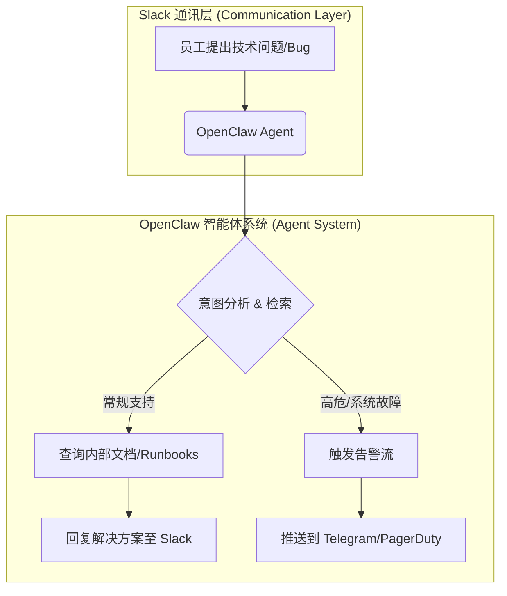

# Slack Auto-Support & Incident Response

## 1. 业务场景与价值 (Business Context & Value)
OpenClaw 被部署在内部的 Slack 频道（如 `#ops-triage` 或 `#internal-support`）中，作为一个自主运营的参与者。它持续监控频道中的新请求、识别潜在的生产问题，并直接基于内部知识库提供第一层解答或解决方案。对于高优的事件，它还会自动将其升级到外部通知频道（如 Telegram）。这种方法将 Slack 从一个被动的通讯层转变为了一个活跃的自动运维面。

**核心商业价值**：
- **降低支持负荷**：大幅减少高级工程师处理低级事务（Triage）和排查常规问题的时间。
- **加快响应闭环**：第一时间从对话流中捕捉上下文并输出解决建议，实现近乎实时的 IT/Ops 支持。

## 2. 系统架构与工作流 (System Architecture & Workflow)

## 3. 技术组件拆解 (Technical Components Breakdown)

| 组件类型 | 详细说明 |
| :--- | :--- |
| **Skills / Tools** | `slack_api` (读取和发送频道消息), `vector_search` (检索内部文档与 Runbooks), `telegram_notify` (高危升级推送)。 |
| **Heartbeats / Cron** | **核心驱动**：依赖 `Heartbeats` 实现对 Slack 的后台持续轮询或 Webhook 状态检查。Heartbeat 设定为每隔 1-5 分钟触发一次 `Ops Triage` 的例行巡检任务，一旦检测到有未读的求助信息，立即在独立 Session 中派生 Subagent 进行答复。 |
| **Memory / Context** | 维护最近 24 小时的事件日志状态，确保在跟进同一报错时不会发生重复答复（Context Window & Diffs）。 |

## 4. 商业评估与量化 (Business Evaluation & Quantization)
基于该架构，我们可以使用简单的公式来量化节约的工程成本（Cost Savings, $C_s$）：

$$ C_s = \sum_{i=1}^{N} (T_{triage} \times W_{eng}) - C_{agent} $$

其中：
- $N$ 为每月拦截的支持工单或 Bug 数量。
- $T_{triage}$ 为高级工程师每次分发/初排问题所需的平均耗时（小时）。
- $W_{eng}$ 为工程师的每小时时薪。
- $C_{agent}$ 为 OpenClaw 基础设施和模型推理的月度成本。

在实际使用中，不仅 $C_s \gg 0$，更重要的是将释放的注意力转移到了高ROI的系统架构开发中。

## 5. 参考来源 (References)
- [Codebridge: OpenClaw Business Use Cases](https://www.codebridge.tech/articles/openclaw-case-studies-for-business-workflows-that-show-where-autonomous-ai-creates-value-and-where-enterprises-need-guardrails)
