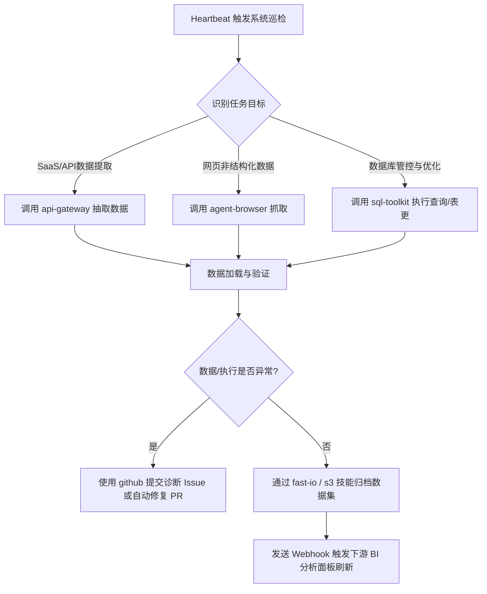

# Autonomous Data Engineering Pipeline

**Sources**: https://fast.io/resources/best-clawhub-skills-data-engineering/

## 1. 应用场景 (Application Scenario)
**背景与目标**：在现代数据工程团队中，ETL（Extract, Transform, Load）流水线监控、数据库模式（Schema）变更、以及数据质量验证往往需要耗费大量的人力。传统的调度工具（如 Airflow）缺乏自主推理能力，当任务在凌晨崩溃或遇到源数据结构偏移（Schema Drift）时，仍需要工程师手动介入排查。此应用案例旨在使用 OpenClaw 充当“数据管道控制器（DataRouter/ETL）”，通过集成多种 ClawHub 技能，实现完全自主的数据拉取、验证、错误自动排查及存储流转控制。

**痛点**：传统 ETL 缺乏自适应修复能力；多数据源（SaaS API、网页抓取）的接入和身份验证开发繁琐；数据日志分析和 SQL 性能优化极度依赖人工经验。

## 2. 技术方案 (Technical Architecture/Solution)
此方案将 OpenClaw 配置为自治的数据管道编排节点（Control Plane）。它周期性监控数据源和日志，利用多种技能工具组合完成数据抽取命令的分发与异常恢复。

**核心组件与配置**：
*   **Skills (技能集成)**:
    *   `api-gateway`: 负责通过 OAuth 对接 100+ SaaS API（Salesforce, HubSpot 等）获取源数据。
    *   `sql-toolkit`: 用于连通 PostgreSQL/MySQL 数据库，执行 Schema 迁移脚本，并利用 EXPLAIN 自动分析与优化慢查询。
    *   `fast-io` & `s3`: 将清洗后生成的数据集存储至对象存储平台，并生成用于下游任务的 Webhook 触发器。
    *   `agent-browser` & `brave-search`: 在无 API 的数据源场景下执行无头浏览器数据抓取与文档挖掘。
    *   `github`: 进行流水线代码管理、提 PR 修复逻辑、以及 CI 构建异常的自动建 Issue。
*   **Heartbeat 配置**:
    设置定时 Heartbeat 守护进程，提示词配置为：`检查本地 filesystem 中的 ETL 日志。若发现执行失败或模式偏移，自主使用 sql-toolkit 生成修复方案，调用 github skill 提交 PR 并在团队频道发送诊断报告。`

**工作流设计图**:

## 3. 实现效果 (Results/Outcomes)
*   **优点**: 极大降低了数据团队在日常维护与异常排障中的人工干预时长。Agent 能够根据报错日志直接给出包含代码的修复建议，部分常规 Schema 漂移问题可直接由机器人闭环修复。统一的 API Gateway 技能免去了重复撰写大量第三方系统 API 胶水代码的麻烦。
*   **缺点**: 数据流转极度依赖大模型的代码生成与推理。针对大规模海量数据，Agent 自身无算力处理真实数据流（Data Plane），必须作为外部引擎（如 Spark/dbt）的控制面板，且在网络隔离的生产级数仓中需要配置复杂的通信代理。
*   **改进空间**: 建议在 OpenClaw 中引入定制 Hooks，对于关键的数据库 `DROP/ALTER/DELETE` 等破坏性操作增加强制性的“人类介入审批（Human-in-the-loop）”安全拦截层。

## 4. 其他相关信息 (Other Info)
*   本地文件系统技能 (`filesystem`) 可被结合用于 Agent 在本地即时读取临时流水线构建日志及处理小规模 CSV/JSON 数据文件，充分发挥本地化计算的安全优势。