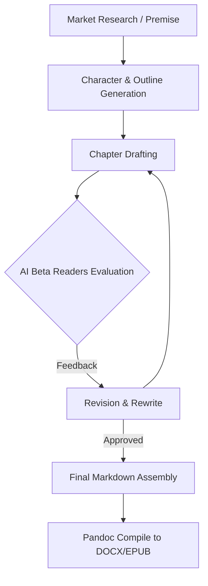

# AuthorClaw - 全自动书籍生成流水线 (Autonomous Book Production Pipeline)

## Sources
- https://openclawlab.xyz/use-cases/authorclaw-writing-agent/

## 1. 应用场景 (Application Scenario)
**背景与目的**：
撰写整本书（小说或非虚构类）是一项浩大的工程，通常需要作者、编辑、排版人员的协作。用户希望通过人工智能实现端到端的书籍全自动生产，从前期的市场调研、大纲设计，到正文撰写、多轮润色，再到最终格式输出。
**主要挑战**：
长篇内容的上下文窗口限制；如何让 AI 保持逻辑和人物设定一致性；如何在同一个流程中模拟不同的人类角色（如作者、试读员、主编）进行对抗和优化；以及最终物料的跨格式（DOCX/EPUB）自动化编译。

## 2. 技术方案 (Technical Architecture/Solution)
AuthorClaw 构建了一个包含 6 个阶段、48 个步骤的流水线（Pipeline）。OpenClaw 在其中扮演了**生成器 (Generator)** 与**任务编排器 (Orchestrator)** 的复合系统角色。

### 工作流详情：
1. **市场与大纲阶段**：主 Agent 使用 `web_search` 工具进行市场分析，结合用户初始提示词，生成核心前提 (Premise) 和角色卡 (Character Sheets)，并通过 `write` 写入本地 Markdown 文件，建立“记忆库”。
2. **正文生成阶段**：主 Agent 根据大纲，逐章迭代生成内容。它通过 `read` 工具始终挂载角色卡和前置章节摘要，以保证连贯性。
3. **多轮对抗编辑阶段**：
   - OpenClaw 利用 `sessions_spawn` 机制，并行生成多个具有独立角色的子 Agent（例如“毒舌书评人”、“逻辑纠错员”等 AI Beta Readers）。
   - 子 Agent 审阅生成的章节并提供反馈。主 Agent 根据反馈进行 3 轮重写（3-pass editing）。
4. **最终编译阶段**：主 Agent 使用 `exec` 工具调用本地的 `pandoc` 命令，将经过审核的 Markdown 文件批量编译为 DOCX 和 EPUB 格式，并生成配套的发布物料（如简介、宣传语）。

### 核心使用的 OpenClaw 功能：
- **Skills & Plugins**: File Management (用于维护章节和人物设定状态), Web Search (用于初始市场分析)。
- **Subagents (sessions_spawn)**: 用于在多轮编辑阶段模拟不同视角的 Beta 读者。
- **Heartbeat**: 由于整个生成过程耗时极长，系统配置了自定义的 Heartbeat 定时触发器，允许 OpenClaw 在资源耗尽前保存状态 (Checkpoint) 并分发下一个批次的章节生成任务。

## 3. 实现效果 (Results/Outcomes)
**优点**：
- **极高的自动化程度**：完整实现了从“一个想法”到“出版就绪文件”的无缝对接，6 个阶段 48 个步骤全程无需人工干预。
- **质量控制**：通过引入多 Agent 视角的 3 轮审查机制，显著降低了长篇 AI 文本常见的“幻觉”和“逻辑崩塌”问题。

**不足与改进方向**：
- **执行时间长**：全书生成可能需要数十小时，对 API 的速率限制 (Rate Limits) 挑战较大，需进一步优化重试机制和断点续传逻辑。
- **细节一致性**：尽管有角色卡，长篇小说后期仍偶尔会出现细微的场景设定冲突，需要更强大的本地 RAG（检索增强生成）记忆检索工具来辅助。

## 4. 其他相关信息 (Other Info)
该用例展示了 OpenClaw 从单纯的“对话助手”向“复杂资产生成引擎 (Complex Asset Generator)”的转变，证明了基于文件的状态传递结合子系统 (Subagent) 编排，能有效打破大语言模型单次生成的长度与逻辑上限。