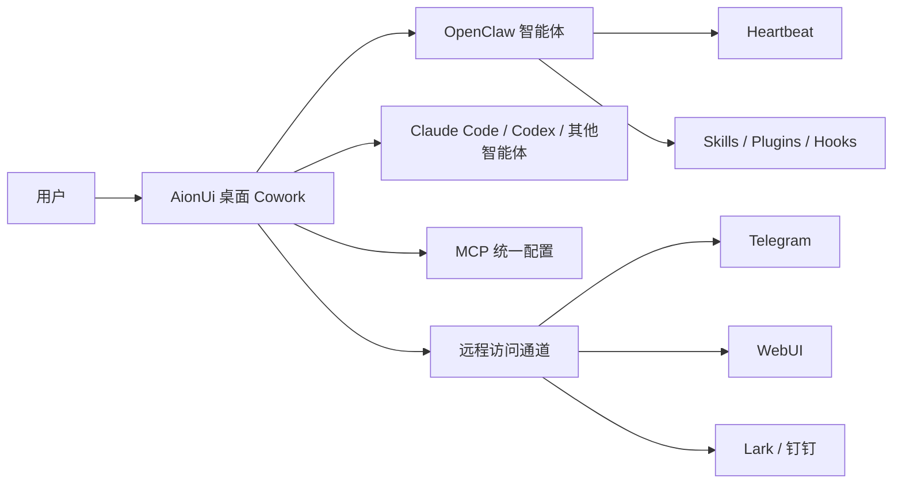
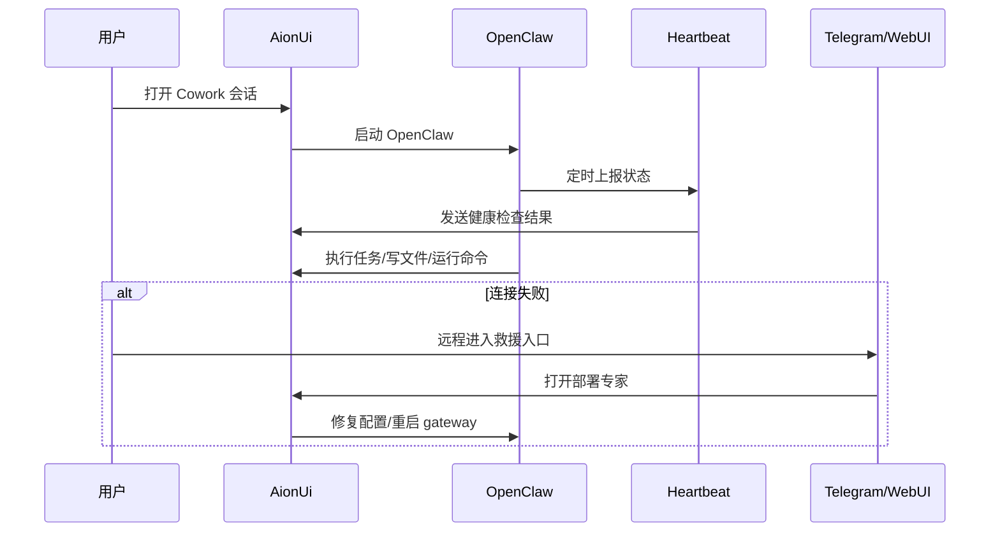

# AionUi 桌面 Cowork 中的 OpenClaw 应用实例

## Sources
- https://github.com/hesamsheikh/awesome-openclaw-usecases/blob/main/README_CN.md
- https://github.com/hesamsheikh/awesome-openclaw-usecases/blob/main/usecases/aionui-cowork-desktop.md
- https://github.com/iOfficeAI/AionUi
- https://docs.openclaw.ai

## 1. 应用场景

AionUi 将 OpenClaw 放进一个桌面 Cowork 工作台里，让用户能“看见”智能体在做什么，不再只是看终端输出。它适合同时使用多个 CLI 智能体的人，尤其是需要在同一工作区里运行 OpenClaw、Claude Code、Codex 等工具的场景。

核心目的有两个：
1. 把 OpenClaw 变成可视化、可协作的桌面工作流。
2. 当 OpenClaw 连接异常、用户又不在机器前时，提供远程救援入口。

主要困难在于：
- OpenClaw 常以 headless 或远程方式运行，故障时不易排查。
- 多智能体工具各自配置 MCP，维护成本高。
- 用户希望从 Telegram/WebUI 远程查看和恢复，而不是只能本地处理。

## 2. 技术方案

### 2.1 总体架构

### 2.2 关键组件解析

| 组件 | 作用 | 说明 |
|---|---|---|
| OpenClaw | 主智能体执行层 | 负责读写文件、运行命令、浏览网页 |
| AionUi Cowork | 可视化工作台 | 让用户直接看到智能体行动轨迹 |
| MCP | 工具统一层 | 一次配置，多个智能体复用 |
| Telegram/WebUI/Lark/钉钉 | 远程入口 | 适合离机时查看、继续和修复 |
| Heartbeat | 主动巡检与自动唤醒 | 负责周期性检查、恢复提醒、自动任务触发 |
| Skills | 任务能力封装 | 如诊断、修复、研究、摘要生成 |
| Plugins | 外部能力接入 | 例如消息通道、自动化接口、远程控制 |
| Hooks | 事件拦截与联动 | 用于登录、消息、失败、任务完成等触发 |

### 2.3 Heartbeat 设计

Heartbeat 是这个方案里最关键的自治组件之一，作用不是“提醒”，而是“持续运行时的状态维持器”。

建议配置：
- `interval`: 15 分钟到 1 小时，视在线频率而定
- `check`: 连接状态、队列状态、未完成任务、失败告警
- `action`: 自动生成简报、恢复建议、是否需要切换到远程通道
- `quiet window`: 夜间降噪，避免无意义打扰

Heartbeat 典型职责：
1. 检查 OpenClaw 是否在线。
2. 检查是否存在挂起任务或失败任务。
3. 在远程环境下触发恢复流程建议。
4. 将状态同步到 WebUI/Telegram 等入口。

### 2.4 推荐工作流

1. 用户在 AionUi 创建 Cowork 会话并选择 OpenClaw。
2. AionUi 自动发现 OpenClaw 与 MCP 配置。
3. OpenClaw 进入任务执行，AionUi 展示文件、命令和网页动作。
4. Heartbeat 定时检查运行状态和未完成任务。
5. 若检测到连接失败，用户从 Telegram/WebUI 进入“部署专家”协助修复。
6. 修复完成后恢复常规 Cowork 会话。

### 2.5 可复现配置示意

| 配置项 | 建议 |
|---|---|
| OpenClaw 安装 | `npm install -g openclaw@latest` |
| 守护进程 | `openclaw onboard --install-daemon` |
| 远程入口 | Telegram + WebUI 优先 |
| MCP 策略 | 统一在 AionUi 配置一次 |
| Heartbeat | 周期巡检 + 异常唤醒 |
| Hooks | 失败告警、会话结束、状态同步 |

### 2.6 Mermaid 序列图

## 3. 实现效果

**优点**
- OpenClaw 从“黑盒命令行”变成可观察的桌面协作界面。
- 多智能体共用 MCP，配置维护更轻。
- 远程救援能力强，离机时也能修复连接问题。
- Heartbeat 让系统更接近 24/7 自运行。

**缺点**
- 依赖 AionUi 作为额外中间层，架构更复杂。
- 远程通道越多，权限和安全边界越难管理。
- Heartbeat 配置不好时，容易产生噪音或误报。

**改进方向**
- 为 Heartbeat 增加分级告警和静默窗口。
- 把修复动作做成更明确的 Runbook。
- 为 MCP 配置增加模板化导入导出。

## 4. 其他相关信息

该案例特别适合：
- 同时使用多个 CLI 智能体的人。
- 需要远程维护 OpenClaw 的用户。
- 希望把 OpenClaw 从“工具”升级成“工作台”的用户。

如果后续要落地，建议优先验证两点：
1. OpenClaw 在 AionUi 中的自动发现与会话稳定性。
2. Heartbeat 在故障恢复链路中的实际触发效果。
