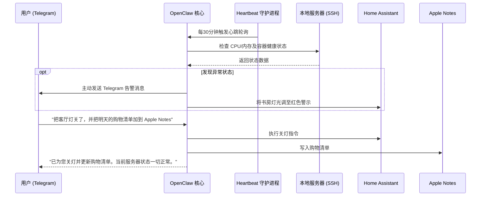

# 智能 HomeLab 与家庭助理中心 (Homelab Telegram Assistant)

**Sources**: 
- [Showcase — What People Are Building with OpenClaw](https://openclaw.ai/showcase)
- X (Twitter) 用户分享：Integrated emails, home assistant, homelab via SSH, todo list, Apple Notes, shopping list. All via a single Telegram chat.

## 1. 应用场景 (Application Scenario)

**背景与目的**：
对于拥有个人服务器（Homelab）及复杂智能家居（Home Assistant）的极客用户而言，通常需要穿梭于多个 App 与终端之间（例如：通过 SSH 管理服务器，通过 Home Assistant App 控制家电，通过 Apple Notes 和提醒事项管理待办与购物清单）。本应用实例旨在使用 OpenClaw 打造一个统一的智能中心，将所有的家庭与服务器管理操作整合进一个 Telegram 聊天对话框中。

**痛点与挑战**：
- **操作碎片化**：不同系统的控制入口分散，缺乏统一的自然语言交互界面。
- **自动化壁垒**：跨平台的联动（例如“如果服务器宕机，同时在待办事项中记录排查任务并调整智能家居灯光报警”）通常需要编写复杂的中间件脚本。
- **状态感知不足**：需要系统具备定时监控并在异常时主动推送报警的能力，而传统被动式机器人无法做到真正的“异步主动关怀”。

## 2. 技术方案 (Technical Architecture/Solution)

本方案以 OpenClaw 为核心，通过 Telegram 作为唯一前端，结合多种 Skills、Plugins 与 Heartbeat 守护进程，构建了一个全能的家庭与服务器管家。

### 核心组件与配置

| 组件类型 | 具体名称/配置 | 功能说明 |
| --- | --- | --- |
| **通道插件 (Plugin)** | `telegram-channel` | 接入 Telegram 机器人 API，实现全天候的移动端自然语言交互。 |
| **技能 (Skill)** | `ssh-homelab` | 允许 OpenClaw 通过预置的公钥凭证 SSH 连接至家庭服务器（如 Hetzner 或本地服务器），执行 Docker 重启、状态巡检等操作。 |
| **技能 (Skill)** | `home-assistant-api` | 封装 Home Assistant 的 RESTful API/Webhook，实现对灯光、温控器等 IoT 设备的控制。 |
| **技能 (Skill)** | `apple-ecosystem` | 通过本地 AppleScript 钩子或 iCloud API 接入 Apple Notes 与 Reminders，实现跨平台清单同步。 |
| **系统调度** | **Heartbeat** | 关键配置！每 30 分钟触发一次心跳，使 OpenClaw 能够主动拉取服务器监控面板和邮件收件箱的最新状态。 |

### 工作流 (Workflow) Diagram

### Heartbeat 配置要点
通过在工作区的 `HEARTBEAT.md` 中配置主动巡检任务：
> "检查服务器监控面板是否报警；检查收件箱是否有包含 'Invoice' 的重要邮件；如果一切正常，保持静默回复 HEARTBEAT_OK。如有异常，主动向 Telegram 发送报警概要。"

## 3. 实现效果 (Results/Outcomes)

**优势 (Pros)**：
- **极简交互**：将复杂的 SSH 命令和 API 调用抽象为自然语言，极大降低了管理心智负担。
- **高阶联动**：成功打破了物理设备控制与数字信息管理的次元壁（例如将监控告警与智能家居灯光颜色绑定）。
- **主动式体验**：得益于 Heartbeat 的异步机制，机器人从“指令响应器”进化为“主动告警员”。

**不足与改进空间 (Cons & Areas for Improvement)**：
- **安全性风险**：赋予单个 AI 极高的 SSH 和家庭控制权限，一旦 Prompt 注入或误解指令，可能导致意外的系统宕机或隐私泄露。建议在敏感技能（如重启服务器、删除文件）上配置强制的人工确认环节（`/approve`）。
- **状态同步延迟**：Home Assistant 的某些即时状态变化（如门窗传感器触发）如果未配置双向 Webhook，仅靠 Heartbeat 轮询可能存在几分钟的延迟。

## 4. 其他相关信息 (Other Info)

在实际部署中，用户选择了 Hetzner 云服务器搭配 Tailscale 异地组网，将云端的 OpenClaw 实例与家中的 Homelab 安全连通。这表明 OpenClaw 非常适合与现代零信任内网穿透工具结合使用，从而实现跨物理地域的本地化 AI 服务。
