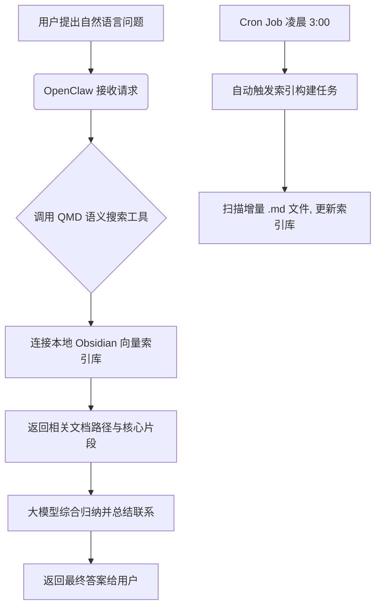

# 知识库语义搜索：Obsidian 深度结合

**Sources**: 
- https://gist.github.com/velvet-shark/b4c6724c391f612c4de4e9a07b0a74b6

## 1. 应用场景 (Application Scenario)

**背景与目的**：
现代知识工作者通常会使用 Obsidian 等本地 Markdown 工具构建“第二大脑”。当笔记数量积累到数千篇（包含日常日志、项目笔记、研究资料等）时，传统的关键词搜索很难精准召回相关联的知识点。
本应用场景利用 OpenClaw 结合 QMD (或者本地语义检索方案)，实现对整个 Obsidian 知识库的语义级搜索，帮助用户跨笔记寻找关联信息并进行智能总结。

**面临的挑战**：
1. 本地笔记数量庞大（2800+ 篇），需要高效建立和维护向量索引。
2. 需要过滤系统目录（如 `.obsidian/`, `.trash/`, `Templates/`）以防干扰。
3. 问答请求不仅需要定位关联的文档片段，还需要 Agent 在多篇文档之间梳理脉络并总结。

## 2. 技术方案 (Technical Architecture/Solution)

**工作流**：
1. **初始化索引**：调用自定义脚本或 QMD 工具为指定目录下所有的 `.md` 文件构建 Embedding 索引。
2. **定时更新 (Cron/Heartbeat)**：配置每日凌晨 3:00 的 Cron 任务，自动重新扫描更新的文件并增量构建索引。
3. **自然语言查询**：用户在 Discord 或 Web 界面发送自然语言问题，OpenClaw 通过语义搜索工具提取最匹配的文档路径与核心片段。
4. **归纳总结**：OpenClaw 分析找出的多篇关联文档，总结其联系，最后返回详细的解答给用户。

**核心组件配置**：
- **Skills/Plugins**: `qmd-semantic-search` (或本地向量检索脚本)
- **Cron Jobs**: 
  - `cron` 任务设定为每日凌晨 3:00，Payload 设置为 `agentTurn`，让 Agent 后台自动运行索引更新。
- **Heartbeat**: 
  - 定期的 Heartbeat 用于监控本地目录的文件变化，若短时间内检测到大量知识库更新，可以通过 Heartbeat 提示用户是否需要立即执行一次非定时的索引同步。

## 3. 实现效果 (Results/Outcomes)

**优势**：
- **突破关键词限制**：支持诸如“我上个月对缩略图设计做出了什么决定？”这类的语义查询。
- **自动归纳关联**：当涉及多个不同维度的笔记时，Agent 能像助理一样将分散的信息碎片整合为连贯的答案。
- **隐私安全**：计算和检索在可控环境下进行，极大地保障了个人知识库的隐私。

**不足与优化空间**：
- 增量更新机制需要严格的差异对比，否则全量重建索引可能会消耗过多的 Token 或计算资源。
- 检索效果高度依赖于 Embedding 模型的维度和理解能力，中英文混合的知识库可能会面临跨语种检索的精准度挑战。

## 4. 其他相关信息 (Other Info)

建议在 Discord 中专门建立 `#video-research` 或类似频道的知识查询专用环境，并为其配置推理能力更强的模型（如 Claude 3.5 Sonnet 或 Opus），而在日常的后台 Heartbeat 监控扫描中采用较便宜的轻量级模型。