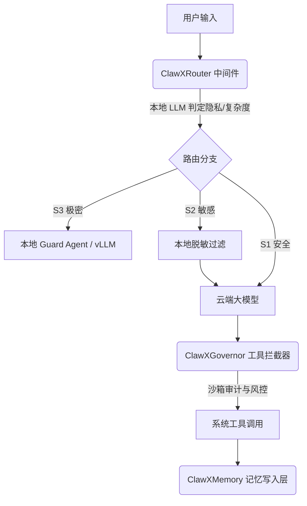

# EdgeClaw: 端云协同与治理中间件架构 (Edge-Cloud Collaborative & Governance Middleware)

## Sources
- https://github.com/OpenBMB/EdgeClaw

## 1. 应用场景 (Application Scenario)
**背景与目的**：
随着 OpenClaw 在复杂工程场景中的深度使用，完全依赖云端大模型暴露出了三大致命痛点：高昂的 Token 成本、敏感隐私数据（如 API Key、薪资、内部代码）外泄风险、以及长时间会话导致的上下文窗口崩溃。
为了解决这些问题，清华大学（THUNLP）、OpenBMB 等机构联合推出了 EdgeClaw。在此架构中，**OpenClaw 的角色发生了根本性转变：从单纯的“任务执行者（Automation/Interactive）”，演变成了一个“边缘网关与治理中间件（Middleware/EdgeNode）”**。它介于用户输入与云端大模型之间，负责路由分发、隐私脱敏、上下文治理和工具审计。

**困难与挑战**：
- **动态路由判定**：如何准确判断一个请求是该发给便宜的模型还是昂贵的推理模型？
- **上下文尾部坍塌**：在超过 30 轮的超长对话中，如何保证核心记忆不丢失且 Token 开销可控？
- **工具调用失控风险**：子智能体或主智能体在执行不受限的 Bash 工具时，如何从底层沙箱进行拦截和审计？

## 2. 技术方案 (Technical Architecture/Solution)
EdgeClaw 引入了一整套 Middleware（中间件）钩子（Hooks），在模型调用、提示词构建、工具执行的前后进行无缝拦截。

### 核心中间件模块 (Core Middleware Components)
1. **ClawXRouter (成本与隐私路由网关)**：
   - 采用 `LLM-as-Judge` 机制。在本地运行一个小参数模型（如 Qwen3.5），对用户的请求进行实时评估。
   - **成本路由**：简单任务（格式化、翻译）打到 gpt-4o-mini；复杂任务打到 claude-sonnet-4.6。
   - **隐私三级分流**：S1（安全直连云端）、S2（本地脱敏替换为 `[REDACTED]` 后发云端）、S3（纯本地处理，云端只留占位符）。
2. **ClawXGovernor (工具治理与审计中间件)**：
   - 包含三大 Hook：上下文尾部截断（Context tail-window trimming）、工具调用风险拦截与审计、会话笔记增量追加。
3. **ClawXMemory (多层结构化记忆引擎)**：
   - 放弃了传统的全局矢量召回，改为 L0（原始对话）-> L1（片段摘要）-> L2（项目时间线）+ Global（用户画像）的多层结构，模型按需进行“主动推理回溯”。
4. **ClawXKairos (自驱动主循环)**：
   - 提供 Tick 调度和休眠（Sleep）工具，让 Agent 从被动响应转为后台长程自驱动。

### 架构示意图 (Architecture Topology)

## 3. 实现效果 (Results/Outcomes)
**优势 (Pros)**：
- **大幅降本增效**：通过 LLM-as-Judge 路由机制，成功将 60-80% 的流量分发到低成本模型，实测 PinchBench 跑分提升 6.3% 的同时，**降低了 58% 的 API 成本**。
- **长会话稳定性**：ClawXGovernor 的截断机制在 30 轮调用测试中节省了 85% 的冗余 Token，彻底解决了 Claude Code 级别的长程崩溃问题。
- **零业务代码入侵**：全部治理逻辑基于 13 个系统 Hook 实现（如 `before_model_resolve`, `before_tool_call`），对底层业务完全透明。

**劣势与改进空间 (Cons & Areas for Improvement)**：
- **额外的边缘推理延迟**：每次路由判定都需要本地小模型运行一次 LLM-as-Judge，会引入约 1-2 秒的 First-Token 延迟。
- **部署门槛高**：完全体需要本地部署 vLLM、Ollama 及多套 SQLite 数据库，对边缘节点的算力有一定要求。

## 4. 其他相关信息 (Other Info)
- **沙箱隔离**：采用了彻底摒弃 Docker 开销的系统级沙箱（`bwrap` / `sandbox-exec`），做到轻量化、零依赖执行。