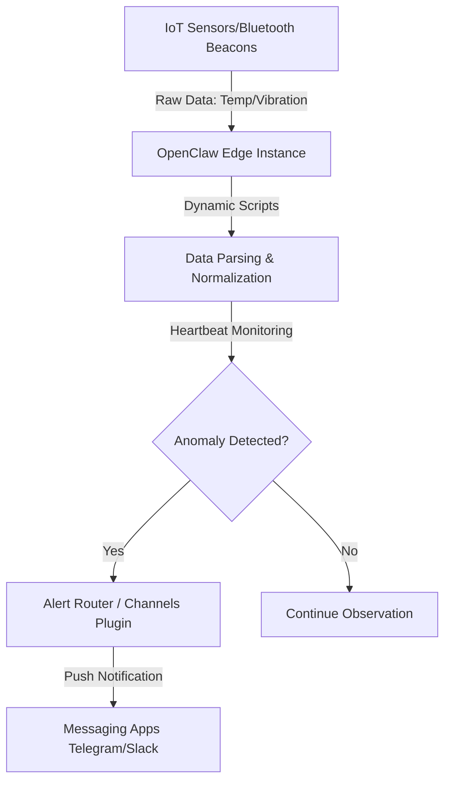

# IoT Predictive Maintenance Observer

**Sources**: https://www.minew.com/openclaw-and-iot/

## 1. 应用场景 (Application Scenario)
在复杂的物联网（IoT）和工业环境中，设备种类繁多且标准不一，传统的设备监控依赖云端分析且适配周期长。本应用场景利用 OpenClaw 作为边缘观察者（Observer），通过高级蓝牙信标等方式在后台持续监控精密机器传感器的数值（如物理振动的微小变化、环境温度、电力消耗等），以在机械部件发生严重磨损或故障前进行预测性维护预警。

## 2. 技术方案 (Technical Architecture/Solution)
OpenClaw 在本方案中扮演持续观测与数据路由的边缘系统角色：
- **本地化部署（Edge Computing）**：OpenClaw 直接部署在靠近数据源的本地硬件上，使用本地大模型进行数据处理，确保数据隐私与极低的延迟。
- **动态传感器适配（Dynamic Scripting）**：针对碎片化的 IoT 设备，OpenClaw 可以利用其自主编写和执行代码的能力，动态生成自定义脚本来桥接新传感器的通信，无需等待官方固件更新。
- **Heartbeat 持续监控**：配置高频的 `Heartbeat` 机制，使其在后台持续扫描和比对设备传来的环境温度、振动幅度和电流等时间序列数据。
- **异常警报路由（Alert Routing）**：当发现指标超出安全阈值或呈现潜在故障趋势时，通过集成相应的 Channel Plugin，将紧急警报直接路由推送到相关人员的首选即时通讯软件（如 Telegram, Slack 等）。

## 3. 实现效果 (Results/Outcomes)
- **优势 (Pros)**：实现了本地化的数据隐私保护；通过边缘计算降低了对云端连接的依赖；自适应脚本生成极大增强了系统对异构设备的扩展性。
- **不足 (Cons)**：动态生成的代码可能缺乏严格的安全与稳定性测试，在工业级高可用场景中存在风险；本地大模型的推理能力可能受限于边缘设备的算力。
- **优化方向 (Areas for Improvement)**：引入沙盒机制（Sandbox）或 `Auditor` 代理对动态生成的传感器适配代码进行审核与测试。

## 4. 其他相关信息 (Other Info)
该案例展示了 AI Agent 从传统的“对话助手”向“后台基础设施”演进的趋势，OpenClaw 通过结合边缘计算与通信路由能力，成为连接物理世界硬件与人类消息网络的重要桥梁。