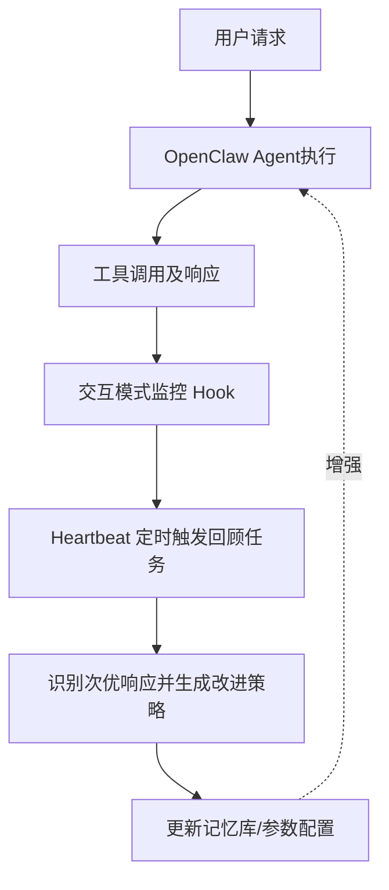

# OpenClaw 自进化引擎优化器

**Title**: OpenClaw Capability Evolver (Self-Evolution Engine)
**Sources**: [PC Build Advisor - Top 20 OpenClaw Skills](https://www.pcbuildadvisor.com/what-are-the-most-popular-useful-openclaw-skills-top-20-with-use-cases/)

## 1. 应用场景 (Application Scenario)
- **背景与目的**：传统的 AI Agent 在处理特定工作流时，其表现通常受限于固定的提示词和配置。本场景下，OpenClaw 扮演了一个系统的“优化器”（Optimizer），通过引入自进化机制，能够持续监控代理与用户的交互模式，并在发现次优响应时自我纠正和学习。
- **难点与挑战**：如何不依赖人工干预和手动配置，让智能体在持续运行中自动总结经验、优化未来的任务执行路径。

## 2. 技术方案 (Technical Architecture/Solution)
此用例开创了 **Optimizer**（优化器/进化引擎）这一新的架构角色，OpenClaw 不仅仅是任务的执行者，而是自身能力的优化者。
- **核心组件与技能**：使用 `capability-evolver`（能力进化者）技能。
- **工作流与配置**：
  1. **交互监控**：利用内部 Hook 监听所有的会话历史和系统调用日志。
  2. **评估与反馈**：结合 Heartbeat 定时触发回顾任务，分析近期的交互模式，识别低效的工具调用或不准确的响应。
  3. **策略更新**：提取改进方案并记录在 OpenClaw 的内存库中，应用到未来的类似任务流中。
  

## 3. 实现效果 (Results/Outcomes)
- **优点**：能够动态适应用户的特定工作流，减少了人工手动编写或调优提示词的成本，实现了真正的“越用越好用”。
- **不足**：在处理全新领域任务时仍需一定的“试错”阶段才能完成经验积累；可能消耗较多的系统 Token 用于后台评估。
- **改进方向**：可进一步增加进化策略的回滚机制，防止“过拟合”或不良经验污染策略库。

## 4. 其他相关信息 (Other Info)
- **安全与认证**：该技能在 ClawHub 拥有超过 35,000 次的安装量，并通过了 Bundled-tier 的安全认证（Verified），且无需额外的 API 密钥即可运行。