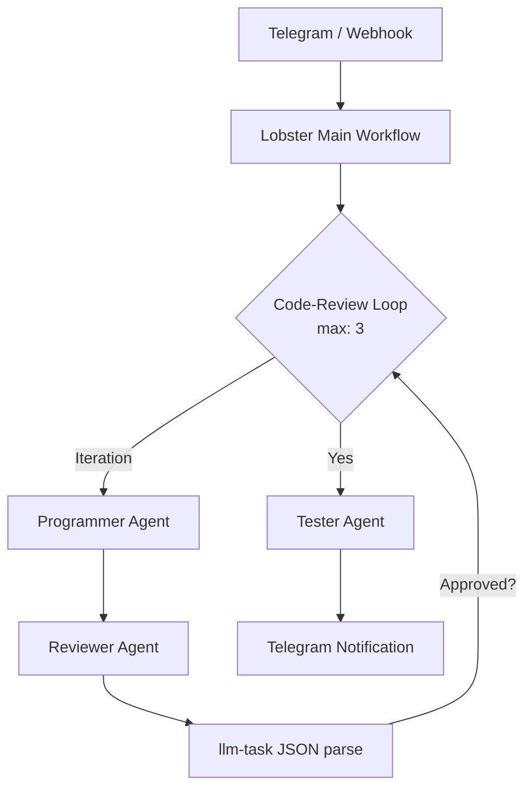

# 确定性多智能体开发流水线 (Deterministic Multi-Agent Dev Pipeline)

## Sources
- https://dev.to/ggondim/how-i-built-a-deterministic-multi-agent-dev-pipeline-inside-openclaw-and-contributed-a-missing-4ool

## 1. 应用场景 (Application Scenario)
需要构建一个全自动的 AI 智能体开发团队（包含程序员、审查员和测试员），在多个项目中并行工作。流水线要求非常明确：编码 → 审查（最多3次迭代）→ 测试 → 完成。该场景的主要挑战在于避免使用大语言模型（LLM）来决定流程走向，因为 LLM 在路由和调度时容易出现非确定性的错误，因此需要一个严格确定的状态机来控制智能体之间的流转。

## 2. 技术方案 (Technical Architecture/Solution)
此用例引入了一种全新的 **Orchestrator (编排器)** 系统角色，通过硬编码的工作流引擎代替 LLM 进行调度。

- **核心组件**：
  - **OpenClaw Gateway & Webhooks**: 接收外部触发器，并通过 Webhooks（带会话路由的 `POST /hooks/agent`）启动不同项目的独立流水线。
  - **Lobster 工作流引擎**: OpenClaw 的内置本地优先工作流引擎。作者为其扩展了子工作流（Sub-Lobsters）和循环功能。
  - **agentToAgent / sessions_send**: 用于智能体之间的对等通信，通过约定的会话键模式（例如 `pipeline:<project>:<role>`）实现精准投递。
  - **llm-task 插件**: 将审查员的文本输出强制转换为包含布尔值（是否通过）的结构化 JSON，供工作流条件判断使用。

- **工作流程** (YAML 驱动)：
  1. 触发主流程 `dev-pipeline.lobster`，传入项目参数。
  2. 调用子流程 `code-review.lobster` 进入编码-审查循环（配置 `maxIterations: 3`）。
  3. 程序员智能体生成代码，审查员智能体进行审查。
  4. 使用 `llm-task` 提取审查结果为 JSON（`{"approved": true}`），若未通过则触发下一次循环。
  5. 若审查通过，流转至测试员智能体执行测试。
  6. 若测试成功，发送 Telegram 通知。

- **隔离性**：每个智能体拥有独立的工作区、独立的工具权限（程序员可读写，审查员只读，测试员可执行测试）以及独立的模型（如 Opus 用于编程，Sonnet 用于审查）。

## 3. 实现效果 (Results/Outcomes)
- **优势**：实现了 100% 的确定性编排，LLM 只负责其擅长的创造性工作（写代码、代码审查），而机器负责可靠的路由、计数和重试，大幅提升了管道的健壮性。统一在 OpenClaw 内运行，零外部基础设施（如 Redis 或复杂的状态机引擎）开销。
- **缺点/改进空间**：该架构强依赖于 Lobster 引擎的子流程和循环能力（由作者提交的 PR #20 实现），在官方正式合并和发布前，需要使用定制版的 Lobster。

## 4. 其他相关信息 (Other Info)
作者在得出此架构前，曾尝试过 Ralph Orchestrator（侧重单智能体硬上下文重置）、OpenClaw 原生子智能体（受限于 LLM 自主决定和最大深度限制），最终发现“通过代码编写 YAML 流水线”远胜于“通过 Prompt 提示词让 LLM 协同”。这一用例完美展示了从基于 Agentic Prompt 的松散协作，走向企业级确定性编排（Orchestration）的架构演进。