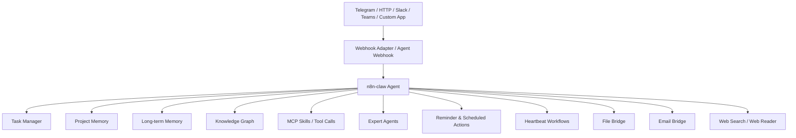

# n8n-claw：基于 n8n 的自托管 OpenClaw 式智能编排代理

## Sources
- https://github.com/freddy-schuetz/n8n-claw
- https://docs.openclaw.ai/tools/plugin

## 1. 应用场景

n8n-claw 是一个完全自托管的智能代理系统，核心目标不是“单点自动化”，而是把对话、记忆、任务、提醒、知识图谱、MCP 技能、外部系统接入统一编排起来。它同时支持 Telegram 和 HTTP API，因此既能面向个人对话，也能作为外部系统的通用 AI 中台。

难点在于：
- 多入口统一路由，既要支持聊天，也要支持 webhook
- 长期记忆不能只靠向量检索，还要兼顾全文、实体和时间衰减
- 需要能把复杂任务拆给专家子代理
- 背景任务、提醒、心跳检查必须持续运行且可扩展
- 技能系统要能动态安装、构建和调用

从技术角色看，它更像一个“智能中间层/编排层”，而不是普通的 Automation_ 脚本。

## 2. 技术方案

### 2.1 架构概览

### 2.2 关键组件

| 组件 | 作用 |
|---|---|
| n8n | 工作流编排引擎 |
| PostgreSQL / Supabase | 数据与状态存储 |
| Claude | 主代理模型 |
| Telegram / HTTP API | 对话与外部接入 |
| MCP Skills | 工具与 API 集成层 |
| Expert Agents | 复杂任务拆分与委派 |
| Heartbeat | 主动提醒、巡检、后台任务 |
| Memory Consolidation | 对话压缩与长期记忆归档 |
| File Bridge | 文件中转 |
| Email Bridge | 邮件接入 |

### 2.3 OpenClaw 相关能力映射

| OpenClaw 能力 | 在该方案中的位置 |
|---|---|
| Skills | 作为 MCP 技能库，支持预置技能和按需构建技能 |
| Plugins | 通过 n8n 的工作流/服务集成扩展能力，且与 OpenClaw 插件机制形成对应关系 |
| Hooks | 通过 Webhook Adapter、Telegram Trigger、后台工作流形成事件钩子式输入输出 |
| Heartbeat | 每 5 分钟主动检查、提醒、清理，另有后台 checker 与记忆归档任务 |

### 2.4 典型工作流

1. 用户从 Telegram 或 HTTP 发起请求
2. 入口适配层标准化消息格式
3. 主代理识别意图，决定是否：
   - 直接回答
   - 查询记忆
   - 调用 MCP 技能
   - 委派专家代理
   - 创建任务或提醒
4. 长期记忆采用混合检索，结合语义、全文、实体匹配与时间衰减
5. 后台 Heartbeat 定期执行：
   - 到期提醒
   - 递归任务检查
   - 静默监控
   - 文件清理
6. Memory Consolidation 每日归档对话到长期记忆

### 2.5 分类判定

这不是普通的 `Automation_`，因为它不是单个任务流自动化，而是一个持续运行的多入口智能中枢。它更适合归入：

- `Orchestrator_`，因为核心职责是统一编排多个代理、技能、记忆和外部系统

### 2.6 可复现配置要点

- 需要启用 n8n instance-level MCP
- 配置 Telegram Bot Token、Chat ID、LLM API Key
- 配置 Webhook Secret
- 按需启用 embeddings、语音、邮箱、文件桥接
- Heartbeat 建议拆为独立后台工作流，避免与主对话流耦合

## 3. 实现效果

### 优点
- 真正把对话、任务、记忆、技能统一起来
- 支持主动行为，不只是被动响应
- 对外可作为 HTTP 中台，对内可作为个人智能助理
- 记忆系统比纯向量库更稳健

### 缺点
- 组件较多，部署和维护复杂
- 依赖 n8n、数据库、LLM、外部服务，运维面较宽
- 功能丰富意味着调试成本高

### 可改进方向
- 增强插件沙箱和权限隔离
- 为不同任务类别增加独立队列
- 引入更细粒度的可观测性与审计日志
- 对专家代理的选择策略做成可配置路由器

## 4. 其他相关信息

该项目同时展示了 OpenClaw 类系统的一个重要趋势：
- 从“单一聊天助手”走向“可编排的代理平台”
- 从“单技能自动化”走向“记忆 + 工具 + 子代理 + 背景任务”的复合架构

这也解释了为什么它应被视为新的系统角色，而不是旧分类里的普通自动化案例。
