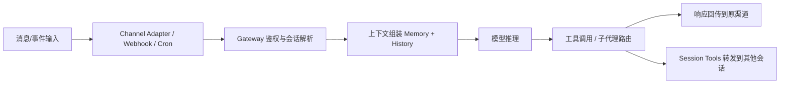

# OpenClaw 作为消息总线编排器

## Sources
- https://www.clawbot.blog/blog/openclaw-50-real-world-use-cases-for-the-open-source-ai-agent-framework/
- https://ppaolo.substack.com/p/openclaw-system-architecture-overview
- https://github.com/openclaw/openclaw/releases

## 1. 应用场景

这类用法里，OpenClaw 不只是“接收指令并执行”，而是作为一个**消息编排层**，把多渠道输入、会话路由、工具调用、定时触发和跨代理协作统一起来。

典型场景包括：
- 多智能体研究/写作流水线的任务拆解与汇总
- 通过消息渠道（WhatsApp、Telegram、Discord、Slack 等）接入的个人助理
- 定时任务、Webhook、外部事件触发后的自动派发
- 会话隔离、权限控制、工具沙箱化执行

难点在于：
- 输入源很多，必须先做身份与会话归属判断
- 任务会跨多个 agent / session 流转，容易丢上下文
- 工具执行需要权限边界和安全控制
- 需要同时支持实时消息与计划任务

## 2. 技术方案

### 核心角色

OpenClaw 在这里扮演的是 **Orchestrator_** 角色，负责：
- 路由消息
- 组装上下文
- 调度 agent 执行
- 协调 session 之间通信
- 处理 cron / webhook 外部触发

### 典型技术栈

| 组件 | 作用 |
|---|---|
| Channel Adapters | 接入消息平台与外部输入 |
| Gateway Control Plane | 鉴权、路由、访问控制 |
| Agent Runtime | 运行模型推理与工具调用 |
| Session Tools | agent-to-agent 通信 |
| Cron Jobs / Webhooks | 定时与外部触发 |
| Memory / Compaction | 长上下文与状态保留 |
| Tool Sandboxing | 限制工具权限与作用域 |

### 工作流

### 可复现配置要点

- **Skills**: 消息渠道技能、调度技能、会话工具、记忆检索、工具执行相关技能
- **Plugins**: 频道插件、外部工具插件、内存/搜索插件
- **Hooks**: 适合在消息入站前做内容过滤、在工具调用前做权限校验、在出站前做格式化
- **Heartbeat**: 建议保留一个低频 heartbeat，用来检查待办、计划任务和异常状态，例如每 30 分钟一次；夜间可降低频率

### 为什么是新角色

它不是单纯的 `Automation_`，因为重点不在“自动化某个业务动作”，而在**把整个 agent 系统当成消息与状态的操作系统**。OpenClaw 在此更像：
- 消息路由器
- 会话编排器
- 事件驱动调度器

这满足严格角色分类里的新系统角色标准，因此可归类为 **Orchestrator_**。

## 3. 实现效果

**优点**
- 架构清晰，适合多渠道、多会话、多 agent 场景
- 适合做长期运行的个人助理或团队协作中枢
- 可扩展到 cron、webhook、消息平台和本地工具

**缺点**
- 系统复杂度高，调试成本上升
- 权限与路由配置需要非常谨慎
- 多代理协作容易出现上下文膨胀

**改进方向**
- 增强可观测性，记录完整路由链路
- 更细粒度的工具权限分层
- 为多 agent 协作增加冲突检测和失败回滚

## 4. 其他相关信息

从来源材料看，这类 OpenClaw 用法强调的是“agents that act”，而不是单纯聊天机器人。它适合做个人 AI 操作系统、消息中枢和跨任务调度层。
