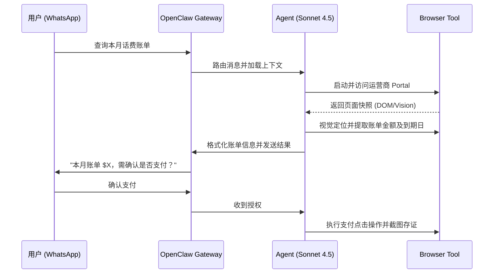

# Life Admin Assistant

**Sources**: https://www.freecodecamp.org/news/how-to-build-and-secure-a-personal-ai-agent-with-openclaw/

## 1. 应用场景 (Application Scenario)
在日常生活中，个人用户需要处理大量分散的行政性任务，例如：查询不同运营商的话费和账单、跟进服务工单、预约服务以及追踪跨多个平台（WhatsApp, Slack, Email）的截止日期。由于大多数个人消费平台不提供公开的 API，传统的自动化工具难以接入。
此场景的核心难点在于：
- 目标网站大多需要复杂的身份验证且没有API。
- 涉及敏感的个人账单和资金操作，完全自动化存在极大风险。
- 需要将多渠道的信息汇总并进行日程同步。

## 2. 技术方案 (Technical Architecture/Solution)
此用例引入了 **Proxy_**（代理执行器）的架构模式。OpenClaw 作为用户的数字代理，携带用户的认证状态在沙盒环境中操作，同时通过安全策略实现严格的“人类在环（Human-in-the-loop）”审批。

**核心组件与配置：**
- **通信渠道 (Channel)**: 接入 WhatsApp，并配置严格的 `allowlist` 和 `token` 鉴权，仅允许特定手机号发起请求。
- **工具与插件 (Tools & MCP)**: 
  - `browser`: 启用浏览器自动化（非无头模式以供调试，使用独立 profile 隔离会话），通过视觉推理（而非脆弱的 CSS/Selenium 脚本）解析 DOM 并提取账单金额和日期。
  - `@modelcontextprotocol/server-filesystem`: 仅对特定的 admin 文档目录开放读写权限。
  - `@anthropic/mcp-server-google-calendar`: 代理读取和创建日程提醒。
- **调度机制 (Heartbeat)**: 配置每 30 分钟一次的心跳触发（避开睡眠时间），使用低成本模型（如 Claude Haiku）在后台检查待办事项和新邮件。
- **安全与权限控制 (Security)**: 
  - 在 `SOUL.md` 和 `AGENTS.md` 中设定硬性边界：“在提交表单前必须截图发送给用户审批”、“严禁在未经授权时点击支付/确认按钮”。
  - 将网关绑定到 `127.0.0.1`，并对配置目录实施 `chmod 700`。

**工作流示例 (Mermaid)**:

## 3. 实现效果 (Results/Outcomes)
- **优势**: 彻底摆脱了传统 RPA 对固定页面结构的依赖。借助大语言模型的视觉推理能力，即使页面布局发生轻微变化也能成功提取账单；通过 WhatsApp 提供极其自然的交互和审批体验。
- **劣势**: 浏览器自动化执行速度相对较慢；若运营商网站引入复杂的反爬或动态验证码（Captcha），任务链路可能会被阻断。
- **改进空间**: 对于高度敏感的数据（如完整账号或医疗信息），可利用 OpenClaw 对接本地 Ollama（如 Llama3.1-8B）来处理敏感信息的结构化解析，防止数据流向云端。

## 4. 其他相关信息 (Other Info)
该实现强调了在个人 AI 代理架构中，如何通过多层安全机制（本地绑定、文件权限、防提示词注入指南）来降低因自动执行带来资金或数据丢失的风险。
