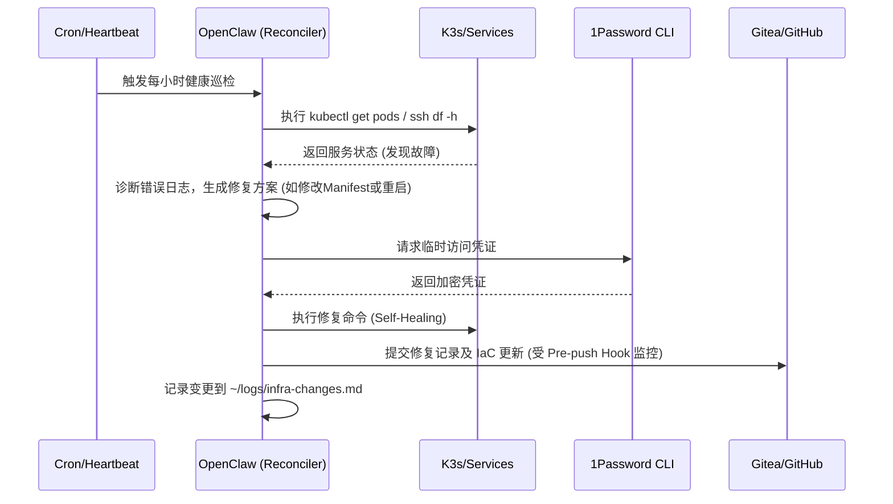

# Self-Healing Home Server

## Sources
- https://github.com/hesamsheikh/awesome-openclaw-usecases/blob/main/usecases/self-healing-home-server.md
- https://madebynathan.com/2026/02/03/everything-ive-done-with-openclaw-so-far/

## 1. 应用场景 (Application Scenario)
**背景与目的**：
管理家庭服务器或个人基础设施（Home Lab）通常意味着需要 24/7 随时待命。服务可能在凌晨崩溃，证书可能悄无声息地过期，磁盘可能被写满，或者 Kubernetes Pod 陷入崩溃循环。该用例旨在将 OpenClaw 转化为一个持久运行的基础设施管理代理（Infrastructure Agent），赋予其 SSH 访问权限和自动化 Cron 任务调度能力，使其能够在用户发现问题之前自主检测、诊断并修复系统故障。

**痛点与挑战**：
- 健康检查、日志监控和告警需要耗费大量精力进行手动配置和持续关注。
- 当服务中断时，用户必须通过 SSH 登录进行繁琐的诊断和修复（有时甚至只能用手机操作）。
- 基础设施即代码（IaC，如 Terraform、Ansible、K8s Manifests）需要定期维护和更新。
- 最核心的挑战在于安全风险：赋予 AI 代理高权限的同时，极易发生密码、API Key 等敏感凭证被 AI 硬编码到脚本或代码库中的情况（即“AI不具备人类的安全直觉”）。

## 2. 技术方案 (Technical Architecture/Solution)

**架构角色 (Reconciler)**：
OpenClaw 在此架构中扮演了 `Reconciler`（状态协调器/自愈控制器）的角色。它持续观察系统当前状态，与期望状态进行比对，并在发现偏差（如服务宕机、资源耗尽）时，自动执行修复操作。

**核心技术组件**：
- **Skills/工具链**: 
  - `ssh`：用于连接家庭网络内的所有机器（如 192.168.1.0/24）。
  - `kubectl`：用于 K3s 集群管理。
  - `terraform` & `ansible`：用于执行基础设施即代码。
  - `1password` CLI：安全的凭证获取，避免硬编码。
  - `gog` CLI：用于读取和处理系统告警邮件。
- **Heartbeat & Cron 配置**: 依赖 OpenClaw 的任务调度系统（Cron/Heartbeat）驱动定期巡检：
  - *每小时*：监控健康检查（Gatus, ArgoCD, 服务端点）。
  - *每6小时*：自检（运行 `openclaw doctor`、磁盘/内存巡检、日志提取）。
  - *每天 8:00 AM*：生成并推送晨报（系统健康、日历、待办事项）。
- **安全拦截器 (Pre-push Hooks)**：强制使用 TruffleHog 等工具进行 Secret 扫描，防止 AI 推送包含敏感信息的代码。

**工作流 Mermaid 图解**：

## 3. 实现效果 (Results/Outcomes)

**优势**：
- **真正的零干预运维**：系统能够自动运行 SSH、Terraform 和 kubectl 命令来修复基础设施问题，实现了在管理员察觉前“自我治愈”。
- **价值复利**：自动化计划任务（健康检查、邮件分拣、晨报生成）能够每天稳定输出价值，避免了临时手动排障的疲惫感。
- **强制的安全最佳实践**：通过设置本地优先的 Git 工作流（Gitea）和基于 CI 的代码扫描，在享受 AI 便利的同时守住了安全底线。

**不足与改进空间**：
- **安全防护成本高**：AI 代理极易在未经提示的情况下将 API Key 写入明文配置中，这要求必须配置极为严格的安全护栏（TruffleHog 扫描、网络隔离、只读权限限制）。
- **复杂故障的幻觉风险**：在遇到多级级联故障时，AI 可能做出错误的重启判断或死循环尝试，仍需设置最大重试次数或人工干预熔断机制。

## 4. 其他相关信息 (Other Info)
该模式最初由开发者 Nathan 在《Everything I've Done with OpenClaw (So Far)》中详细记录。他的代理 "Reef" 运行了 15 个活跃的 Cron 任务和 24 个自定义脚本，管理着一个 K8s 集群和一个包含 5000+ 笔记的 Obsidian 知识库。其防御性安全架构（TruffleHog 预推送钩子、本地 Gitea、每日审计）被社区认为是高权限代理部署的教科书范例。