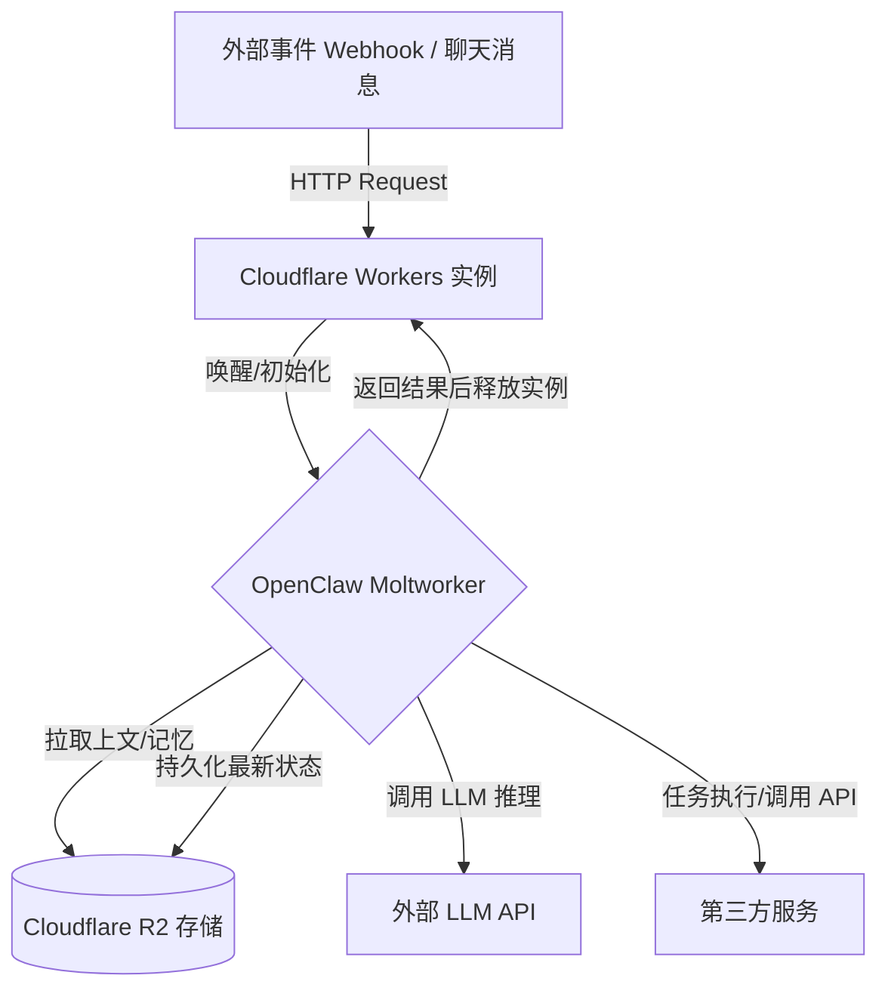

# Title: Serverless Moltworker (Cloudflare Workers)

**Sources**:
- https://research.aimultiple.com/moltbot/

## 1. 应用场景 (Application Scenario)
**背景与目的**：传统的 OpenClaw 部署依赖本地设备或 VPS，要求进程保持后台常驻运行。对于仅需对特定离散事件（如 Webhook 触发、聊天消息）做出响应的自动化任务，传统方式在闲置时会产生不必要的计算资源和服务器成本消耗。
**痛点与挑战**：采用无服务器架构（Serverless）可以解决成本问题，但 Serverless 环境（如 Cloudflare Workers）默认是无状态的（Stateless），导致 AI 代理的对话上下文、长短期记忆（Memory）以及历史日志在单次执行后会丢失，无法满足 OpenClaw 连续性任务和交互的要求。

## 2. 技术方案 (Technical Architecture/Solution)
通过“Cloudflare Moltworker”架构参考实现，将 OpenClaw 的运行逻辑与状态存储解耦，成功将其部署于 Serverless 环境：
- **执行层**：将 OpenClaw 核心代理逻辑打包运行在 Cloudflare Workers 中。
- **存储层**：采用 Cloudflare R2（兼容 S3 的对象存储）作为持久化后端，存储代理的记忆文件、日志和其他执行制品。
- **触发与工作流**：完全摒弃常驻后台运行，代理只在外部请求到达时被唤醒。

### 核心组件与配置
- **Plugins/Hooks**: 
  - `Cloudflare R2 Storage Hook`：用于在 Worker 启动时拉取最新状态文件，在执行完毕休眠前将更新后的记忆序列化并推回 R2。
  - `Webhook Trigger Plugin`：接管入口，解析离散事件触发。
- **Heartbeat**: 禁用定时轮询式 Heartbeat，变更为“事件驱动”（Event-driven），无事件则无计费。
- **Skills**: 支持纯 HTTP/API 驱动的技能（如 `REST API`、`Web_Search`）。禁用所有涉及主机级 Shell 执行、本地文件系统及依赖本地浏览器的 Skills。

## 3. 实现效果 (Results/Outcomes)
**优势 (Pros)**：
- **极致的成本效益**：对于低频率或脉冲型并发任务（如偶尔的客服响应或 PR 审查触发），实现了闲置时零成本。R2 的免费层级（10GB）足以覆盖个人或中小团队测试需求。
- **免运维架构**：无需管理底层操作系统，无暴露本地网关被入侵的安全风险（Remote Takeover Risk 大幅降低）。

**劣势 (Cons)**：
- **运行时间限制**：由于 Serverless 执行时间上限，无法执行持续数十分钟以上的监控或长链路自主任务。
- **能力受限**：不支持任何依赖本地二进制工具、GPU 计算和真实桌面系统沙盒的插件。

## 4. 其他相关信息 (Other Info)
由于 OpenClaw 原生具备非常强的本地权限控制能力，该架构模式反映了一种“去系统化（de-systematization）”的演进方向，将其功能收缩到纯 API 编排器。对于涉及高度敏感业务（不希望 Agent 能够碰触宿主机系统的任何文件）的场景而言，这是一种极致沙盒化的部署变体。