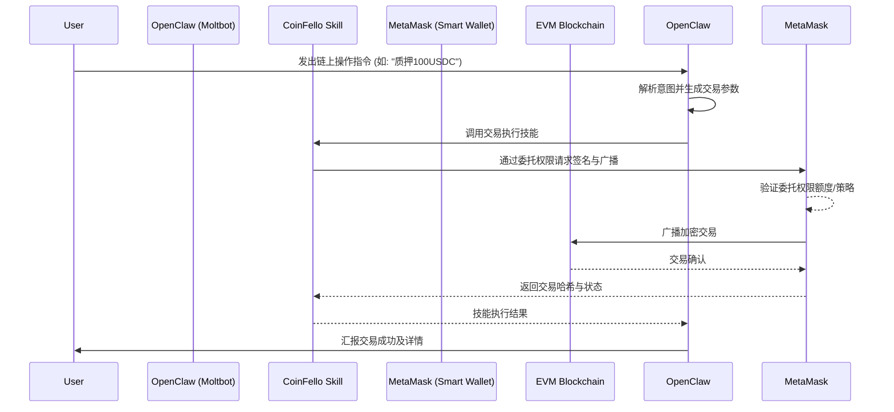

# CoinFello EVM Smart Contract Transaction Skill

## Sources
- https://www.dlnews.com/external/coinfello-launches-openclaw-skill-for-ai-agent-transactions/

## 1. 应用场景 (Application Scenario)
**背景与目的**：
随着AI智能体能力的提升，用户越来越希望AI能够直接与Web3/DeFi协议交互并执行链上交易。然而，直接将加密钱包的私钥赋予AI智能体会带来极大的安全风险。CoinFello 联合 MetaMask 发布了开源的 OpenClaw 技能，旨在让运行在 OpenClaw 上的个人AI智能体（Moltbots）能够通过委托智能钱包权限，安全地执行 EVM 智能合约交易。

**主要挑战**：
- **安全性**：如何隔离AI的决策层与高风险的私钥签名层。
- **权限控制**：如何精细化地授予AI特定合约或特定金额的交易权限。

## 2. 技术方案 (Technical Architecture/Solution)
在本场景中，OpenClaw 扮演着 **Signer（签名委托者/交易执行者）** 的架构角色，主要通过与外部钱包基础设施的安全集成来完成高风险操作。

**核心组件**：
- **Skills/Plugins**: 使用开源的 CoinFello OpenClaw 技能。
- **权限管理**: 依托 MetaMask 提供的委托智能钱包权限（Delegated Smart Wallet Permissions），避免了私钥的直接暴露。

**工作流 (Workflow)**：

**Heartbeat 配置**：
可以配置 Heartbeat 周期性地调用该技能中的查询接口，监控特定钱包余额低于阈值时发出预警，或者追踪已广播交易的链上确认状态。

## 3. 实现效果 (Results/Outcomes)
**优势 (Pros)**：
- **安全性大幅提升**：AI智能体无需接触底层私钥，所有权限受限于 MetaMask 的智能钱包委托策略。
- **无缝自动化**：打通了AI意图到链上执行的最后一公里，实现了 Web3 原生的自动化操作。

**不足与改进空间 (Cons)**：
- **外部依赖**：强依赖 CoinFello 和 MetaMask 基础设施，若接口发生变更可能影响稳定性。
- **Gas费管理**：在网络拥堵时，自动化智能体可能难以像人类一样灵活调整 Gas 策略，存在交易失败或成本过高的风险。

## 4. 其他相关信息 (Other Info)
- 该项目明确服务于 OpenClaw 生态中的 "Moltbots"（个人AI助手），展示了 OpenClaw 在去中心化金融（DeFi）垂直领域的强大扩展性和用例潜力。
