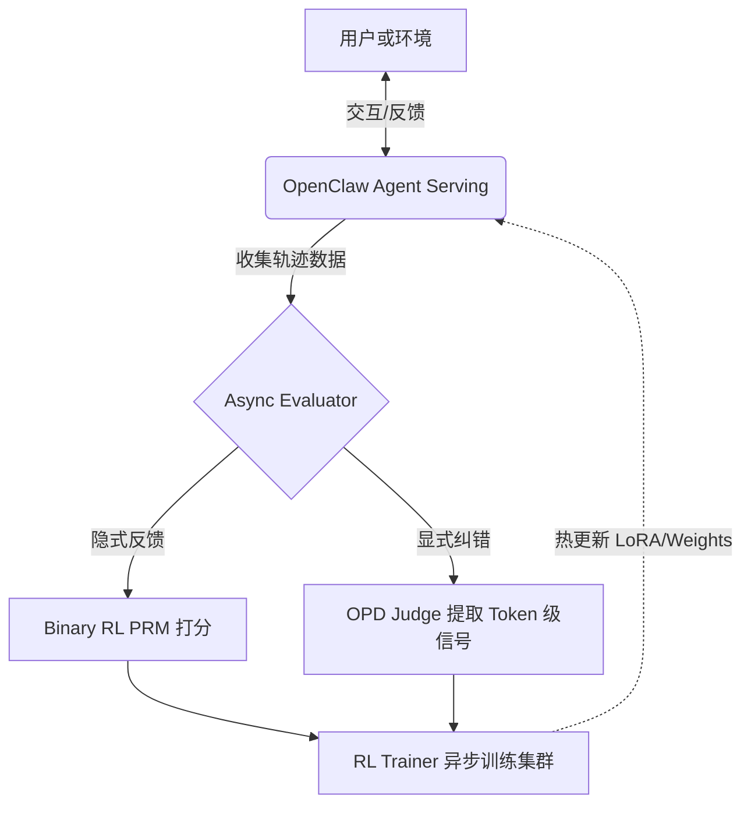

# OpenClaw-RL: 零人工干预的实时对话强化学习训练框架

**Title**: OpenClaw-RL (Train Any Agent Simply by Talking)
**Sources**: [GitHub - Gen-Verse/OpenClaw-RL](https://github.com/Gen-Verse/OpenClaw-RL)

## 1. 应用场景 (Application Scenario)
- **背景与目的**：传统的基于强化学习（RL）的大模型训练通常依赖于中心化的批处理模式和预先收集的数据集。在本项目中，OpenClaw 扮演了一个系统的 **Trainer（在线训练器）** 角色。它将用户的日常闲聊、纠错以及环境（如终端输出、GUI变化）的反馈，直接转化为用于微调模型的训练信号，实现在不中断服务的情况下的持续在线自我进化。
- **难点与挑战**：如何构建一个非阻塞的异步训练架构，使得模型能够同时处理前端推理请求并进行后端梯度更新；如何在“零人工标注（Zero manual labeling）”的前提下，准确捕获用户的隐式反馈（点赞/踩）和显式纠错（如“不要用那个库，你应该先查阅文档”）。

## 2. 技术方案 (Technical Architecture/Solution)
此用例开创了 **Trainer**（实时策略训练器）这一全新的系统角色，采用了与定期离线日志分析完全不同的“实时异步闭环 RL”架构，直接作用于底层模型权重（LoRA/全量微调）。

- **核心组件与插件**：利用自定义的 `rl-training-headers` Extension 拦截实时交互数据，结合后端的 Slime / Tinker 强化学习框架。
- **工作流与架构设计**：
  1. **推理拦截 (Agent Serving)**：OpenClaw 将自托管大模型封装为 API，正常提供对话和工具调用服务，同时在后台静默收集多轮对话轨迹。
  2. **信号提取 (Next-state Feedback)**：系统自动将用户的下一句回复、GUI的视觉变化、或者终端执行的报错信息作为自然状态的奖励信号。
  3. **双轨异步评估 (PRM / Judge)**：
     - **Binary RL (GRPO)**：针对成功/失败、点赞/踩等隐式反馈，过程奖励模型 (PRM) 给出标量分数。
     - **On-Policy Distillation (OPD)**：针对富文本显式反馈，通过 Judge 提取“后见之明”级别的 Hint 并转化为 Token 级的优势信号。
  4. **异步优化 (Combine Method)**：当样本准备就绪时，立即被异步推送到 Trainer 模块进行策略优化，然后热更新至前端。

## 3. 实现效果 (Results/Outcomes)
- **优点**：
  - **零感介入**：推理服务与训练、评估模块完全解耦，用户毫无延迟感知。
  - **多场景泛化**：不仅适用于个人助理闲聊，还能无缝扩展至终端 (Terminal)、界面 (GUI)、软件工程 (SWE) 以及 API 工具调用场景的智能体训练。
  - **高效融合**：组合方法（Combine Method）仅需极少轮次的对话（如 24~36 轮），即可带来明显的策略表现提升。
- **不足**：
  - 对本地算力要求较高（推荐多卡分离部署 Actor、Rollout、PRM 等），或需要依赖云端服务（如 Tinker）。
  - 实时自我更新可能引入奖励作弊（Reward Hacking），安全对齐约束难度大于离线训练。
- **改进方向**：支持更低精度的微调与推理，未来计划将强化学习不仅应用于大模型权重，还延伸至 OpenClaw 的记忆 (Memory) 与技能 (Skills) 库的动态淘汰与更新。

## 4. 其他相关信息 (Other Info)
- **隐私保护**：架构支持纯本地自托管（Self-hosted & private），避免敏感数据的第三方泄露。
- **硬件灵活性**：通过支持 LoRA 等参数高效微调（PEFT）方案，使得个人消费者级 GPU 亦能尝试实时在线智能体的进化训练。