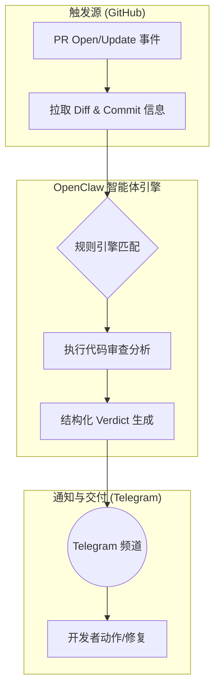

# OpenClaw 应用实例报告：OpenClaw PR Review Automation (Telegram Verdicts)

## 1. 概述与应用场景

### 1.1 背景与目标
在快速迭代的研发团队中，瓶颈往往不在于编写代码，而在于缓慢的 Pull Request (PR) 审查反馈循环。本实例通过 OpenClaw 自动化首轮代码审查（First-pass PR review），并将审查结论推送到 Telegram，旨在缩短等待时间、保持审查纪律，并使得核心开发人员能够专注于高影响力的决策。

### 1.2 核心痛点
- **反馈延迟**：代码提交后需等待人工介入，降低了交付速度。
- **审查碎片化**：远程团队缺乏统一且迅速的代码审查反馈流。
- **审查一致性**：难以在所有 PR 中保持相同标准的审查格式，容易遗漏安全与可维护性检查。

## 2. 技术架构与解决方案实现

通过监听 GitHub PR 事件，OpenClaw 会获取 PR diff、文件变更及 commit 消息，随后根据设定的规则（正确性、安全、可维护性、测试覆盖率）执行审查逻辑，最终以标准化格式输出判决（APPROVE、REQUEST_CHANGES 或 BLOCK）并推送到 Telegram 频道。

### 2.1 整体架构图 (工作流)

### 2.2 核心组件解析

| 组件类型 | 具体应用 / 工具 | 功能描述 |
| :--- | :--- | :--- |
| **Skills (技能)** | github, telegram-notify | 调用 GitHub API 获取 PR diff 数据，随后使用 Telegram 技能推送结构化消息。 |
| **Plugins / APIs** | GitHub Webhooks / Polling | 捕获仓库中的 `pull_request` 打开或更新事件。 |
| **Cron / Heartbeats** | 实时触发 (Event-Driven) | 或基于心跳轮询 GitHub PR 列表，实现异步处理。 |
| **Hooks / Prompts** | 统一的审查 Prompt 模板 | 强制按 Correctness、Security、Maintainability 和 Testability 输出标准化反馈。 |

### 2.3 关键逻辑与算法
系统利用结构化 Prompt 要求模型输出包含三个层级的审查意见：阻塞问题 (Blocking Issues)、优化建议 (Suggestions) 与 补丁计划 (Patch Plan)。
在决定推送频率或拦截阈值时，可引入基于严重性的评分函数。例如设发现缺陷的风险评分为 $S_i$，则 PR 整体风险值定义为：
$$ R_{PR} = \sum_{i=1}^{n} (S_i \times W_i) $$
其中 $W_i$ 为该类缺陷的权重。如果 $R_{PR} > T_{block}$，系统将输出 `BLOCK` 并 @ 代码所有者。

## 3. 实现效果评估

- **好的方面**：
  - 加速了审查流转（Review cycles），减少了上下文切换成本。
  - 标准化的 Telegram 消息体量小、可读性高，适合移动端快速阅读。
- **需要改进的方面/潜在风险**：
  - **终审风险**：AI 审查不能作为最终的合并凭证（Never treat AI review as final approval），必须保持人工的 Merge 权限。
  - **机密性**：对于涉及核心机密的仓库，不应在 Telegram 传递完整的敏感 diff 内容，而应传递摘要级别的结果。
  - **误报率**：初始使用可能产生较多通用建议，需基于开发人员采纳率（Acceptance rates）持续校准 Prompt。

## 4. 参考信息与来源

- **来源 URL**：https://openclawdocs.com/use-cases/openclaw-pr-review-telegram/
- **其他信息**：该用例面向注重异步协同的快速迭代团队，实施成本低，约 1~2 小时即可完成 MVP 阶段的部署。